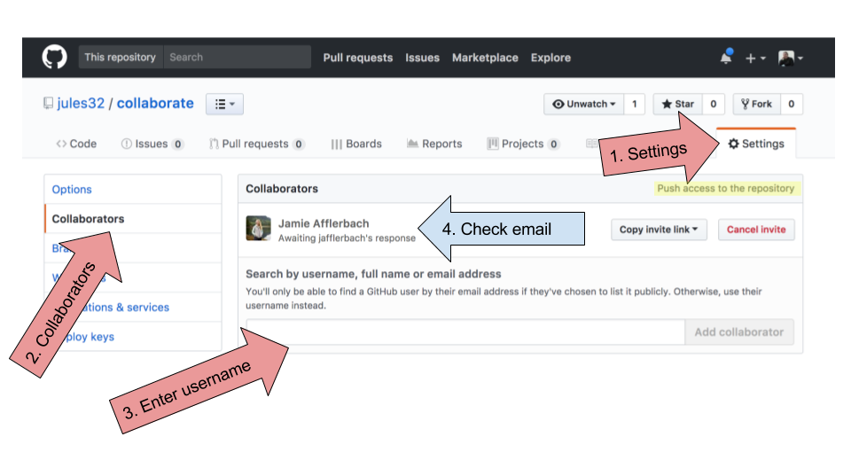
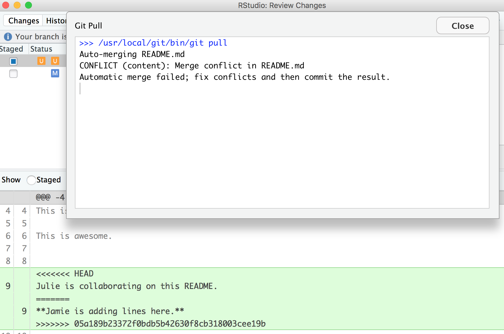
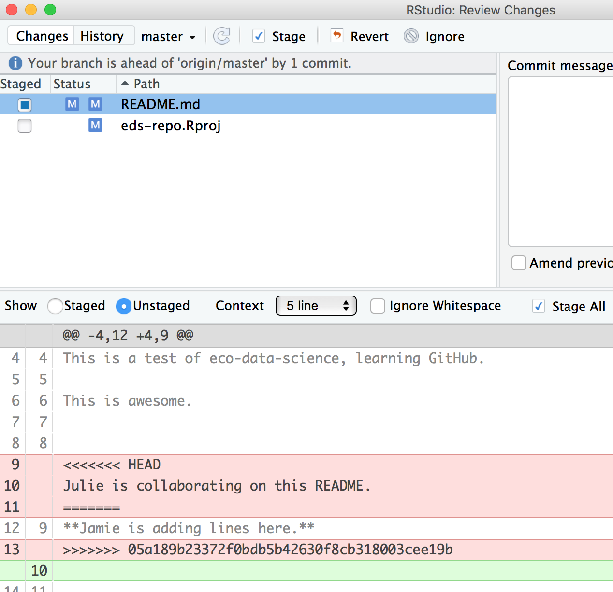

# Collaborating & getting help {#collaborating}
rstats community coding 

## Summary

*TODO: refine* Main purpose: work better with colleagues, help you help yourself. A big theme of this workshop has been how to more seamlessly collaborate with each other.

We are going to build a website with our partner. This is going to happen over the next 2 sessions. 

The collaborative power of GitHub and RStudio is really game changing. So far we've been collaborating with our most important collaborator: ourselves. But, we are lucky that in science we have so many other collaborators, so let's learn how to accelerate our collaborations with them through GitHub! 

We are going to teach you the simplest way to collaborate with someone, which is for both of you to have privileges to edit and add files to a repository. GitHub is built for software developer teams, and there is a lot of features that limit who can directly edit files, but we don't need to start there. 

We will do this all with a partner, and we'll walk through some things all together, and then give you a chance to work with your collaborator on your own. 

### Objectives

- intro to R communities
- How to effectively ask for help
  - Googling. Error messages are your friends
  - R communities and getting help (rOpenSci, RLadies)
  - reprex & RStudio Community "do it with iris"
  - how to use Twitter for #rstats
  - Activity: reprex to GitHub "dplyr reprex"  
- create a new repo and give permission to a collaborator 
- open as a new RStudio project, collaborate with a partner 
- publish webpages online


### Resources

- [Allison Horst ESM 206 Lecture 2](https://docs.google.com/presentation/d/1u1DdhU_WTv1b-sbQgqVGAE-bA2Nq_Yym8BzcPW4lS3k/edit#slide=id.g63942ead2d_0_219)

## R communities (rOpenSci, RLadies)

R4DS
tidytuesday
RUser Groups
R meetups

- Thomas Mock's slides for others

## How to use Twitter for #rstats


## Getting help online
How to ask for, interpret, and act upon help

Folks online have written advice in blogs:

- [Getting help in R: do as I say, not as I've done by Sam Tyner](https://sctyner.github.io/rhelp.html)

### Googling: help you help yourself

#### Error messages are your friends


Borrow/show Allison's slides
- [Allison Horst ESM 206 Lecture 2](https://docs.google.com/presentation/d/1u1DdhU_WTv1b-sbQgqVGAE-bA2Nq_Yym8BzcPW4lS3k/edit#slide=id.g63942ead2d_0_219)

You'll also come across RStudio Community and Stack Overflow
  
#### RStudio community  
  
### reprex

- [reprex.tidyverse.org](https://reprex.tidyverse.org/)
- [](https://resources.rstudio.com/webinars/help-me-help-you-creating-reproducible-examples-jenny-bryan)

`reprex` is a "workflow package". That means that it's something we don't put in Rmds, scripts, or anything else. We use is in the Console when we are preparing to ask for help — from ourselves or someone else. 

Let me demo an example. This is what I'll do (screenshot from [Jenny Bryan's reprex webinar](https://resources.rstudio.com/webinars/help-me-help-you-creating-reproducible-examples-jenny-bryan)

<br>

```{r, echo=FALSE, out.width="80%"}
knitr::include_graphics("img/reprex-bryan.png")  
```

"Conversations about code are more productive with: code that ***actually runs***, that ***I don’t have to run***, and that ***I can easily run***" - Jenny Bryan

reprex includes the output — experienced programmers who you might be asking for help can often read your code and know where the problem lies, especially when they can see the output. 

Jenny Bryan create

`reprex` is part of the Tidyverse, so we all already have it installed, but we do need to attach it: 

```{r reprex-attach}
library(reprex)
```

TODO: what runs and what doesn't run. ```r``` runs in R, but just formatted in issue or md.


`reprex_clean()`
```{r reprex-clean}


```

Demo ideas:
- ggplot (reprex pastes figure)

### Activity: "do it with iris"

Make a reprex and paste it in your Issues

### TODO Sync with your partner


## Create and clone a repo
TODO text

### Create repo (Partner 1)

Team up with a partner sitting next to you. Partner 1 will create a new repository. We will do this in the same way that we did in Chapter \@ref(github): [Create a repository on Github.com]. 

Let's name it `r-collab`. 

### Create a gh-pages branch (Partner 1)

We aren't going to talk about branches very much, but they are a powerful feature of git/GitHub. I think of it as creating a copy of your work that becomes a parallel universe that you can modify safely because it's not affecting your original work. And then you can choose to merge the universes back together if and when you want. By default, when you create a new repo you begin with one branch, and it is named `master`. When you create new branches, you can name them whatever you want. However, if you name one `gh-pages` (all lowercase, with a `-` and no spaces), this will let you create a website. And that's our plan. So, Partner 1, do this to create a `gh-pages` branch: 

On the homepage for your repo on GitHub.com, click the button that says "Branch:master". Here, you can switch to another branch (right now there aren't any others besides `master`), or create one by typing a new name. 


<br>

Let's type `gh-pages`. 

<br>

 

Let's also change `gh-pages` to the default branch and delete the master branch: this will be a one-time-only thing that we do here: 

First click to control branches:

 

And then click to change the default branch to `gh-pages`. I like to then delete the `master` branch when it has the little red trash can next to it. It will make you confirm that you really want to delete it, which I do!

 


### Give your collaborator administration privileges (Partner 1 and 2)

Now, Partner 1, go into Settings > Collaborators > enter Partner 2's (your collaborator's) username. 

Partner 2 then needs to check their email and accept as a collaborator. Notice that your collaborator has "Push access to the repository" (highlighted below):

 

### Clone to a new R Project  (Partner 1)

Now let's have Partner 1 clone the repository to their local computer. We'll do this through RStudio like we did before (see Chapter \@ref(github): [Clone your repository using RStudio]), but with a final additional step before hitting "Create Project": select "Open in a new Session".

<br>

 

<br>
<br>
Opening this Project in a new Session opens up a new world of awesomeness from RStudio. Having different RStudio project sessions allows you to keep your work separate and organized. So you can collaborate with this collaborator on this repository while also working on your other repository from this morning. I tend to have a lot of projects going at one time:

<br>


<br>

Have a look in your git tab. 

Like we saw this morning, when you first clone a repo through RStudio, RStudio will add an `.Rproj` file to your repo. And if you didn't add a `.gitignore` file when you originally created the repo on GitHub.com, RStudio will also add this for you. So, Partner 1, let's go ahead and sync this back to GitHub.com. 

Remember: 


<br> 

Let's confirm that this was synced by looking at GitHub.com again. You may have to refresh the page, but you should see this commit where you added the `.Rproj` file.

### Clone to a new R Project  (Partner 2)

Now it's Partner 2's turn! Partner 2, clone this repository following the same steps that Partner 1 just did. When you clone it, RStudio should not create any new files — why? Partner 1 already created and pushed the `.Rproj` and `.gitignore` files so they already exist in the repo.  

### Create data folder (Partner 2)

Partner 2, let's create a folder for our data and store our `noaa_fisheries.csv` there. 

And now let's sync back to GitHub. 


<br>

When we inspect on GitHub.com, click to view all the commits, you'll see commits logged from both Partner 1 and 2!

> Question: Would you still be able clone a repository that you are not a collaborator on? What do you think would happen? Try it! Can you sync back? 

### State of the Repository

OK, so where do things stand right now? GitHub.com has the most recent versions of all the repository's files. Partner 2 also has these most recent versions locally. How about Partner 1? 

Partner 1 does not have the most recent versions of everything on their computer. 

Question: How can we change that? Or how could we even check? 

Answer: PULL. 

Let's have Partner 1 go back to RStudio and Pull. If their files aren't up-to-date, this will pull the most recent versions to their local computer. And if they already did have the most recent versions? Well, pulling doesn't cost anything (other than an internet connection), so if everything is up-to-date, pulling is fine too. 

I recommend pulling every time you come back to a collaborative repository. Whether you haven't opened RStudio in a month or you've just been away for a lunch break, pull. It might not be necessary, but it can save a lot of heartache later.

## Merge conflicts

TODO: clarify that first when you pull it's because unstaged.

What kind of heartache are we talking about? Let's explore. **Stop and watch me create and solve a merge conflict with my Partner 2, and then you will have time to recreate this with your partner.** Here's what I am going to do:

Within a file, GitHub tracks changes line-by-line. So you can also have collaborators working on different lines within the same file and GitHub will be able to weave those changes into each other -- that's it's job! It's when you have collaborators working on *the same lines within the same file* that you can have **merge conflicts**. Merge conflicts can be frustrating, but they are actually trying to help you (kind of like R's error messages). They occur when GitHub can't make a decision about what should be on a particular line and needs a human (you) to decide. And this is good -- you don't want GitHub to decide for you, it's important that you make that decision. 

So let's test this. Let's have both Partners 1 and 2 go to RStudio and pull so you have the most recent versions of all your files. Now, Partners 1 and 2, both go to the README, and on Line 7, write something, anything. I'm not going to give any examples because I want both Partners to write something different. And be sure to save the README. 

OK. Now, let's have Partner 2 sync: pull, stage, commit, push. Great. 

Now, when Partner 2 is done, let's have Partner 1 (me) try. 

Partner 1: pull ---- Error! Merge conflict!


So Partner 1 is not allowed to pull, it failed. GitHub is protecting Partner 1 because if they did successfully pull, their work would be overwritten by whatever Partner 2 had written. So GitHub is going to make a human (Partner 1 in this case) decide. GitHub says, either commit this work first, or "stash it" (I interpret that as saving a copy of the README in another folder somewhere outside of this GitHub repository). 

Let's follow their advice and have Partner 1 commit. Great. Now let's pull again. 

Still not happy!



<br>

OK, actually, we're just moving along this same problem that we know that we've created: Both Partner 1 and 2 have both added new information to the same line. You can see that the pop-up box is saying that there is a CONFLICT and the merge has not happened. OK. We can close that window and inspect. 

Notice that in the git tab, there are orange `U`s; this means that there is an unresolved conflict, and it is not staged with a check anymore because modifications have occurred to the file since it has been staged. 

Let's look at the README file itself. We got a preview in the diff pane that there is some new text going on in our README file: 

```r
<<<<<<< HEAD
Julie is collaborating on this README.
=======
**Jamie is adding lines here.**
>>>>>>> 05a189b23372f0bdb5b42630f8cb318003cee19b
```

In this example, Partner 1 is Jamie and Partner 2 is Julie. GitHub is displaying the line that Julie wrote and the line Jamie wrote separated by `=======`. So these are the two choices that Partner 2 has to decide between, which one do you want to keep? Where where does this decision start and end? The lines are bounded by `<<<<<<<HEAD` and `>>>>>>>long commit identifier`. 

So, to resolve this merge conflict, Partner 2 has to chose, and delete everything except the line they want. So, they will delete the `<<<<<<HEAD`, `=====`, `>>>>long commit identifier` and one of the lines that they don't want to keep. 

Do that, and let's try again. In this example, we've kept Jamie's line: 



<br>

Then be sure to stage, and write a commit message. I often write "resolving merge conflict" or something so I know what I was up to. When I stage the file, notice how now my edits look like a simple line replacement (compare with the image above before it was re-staged): 


### Your turn

Create a merge conflict with your partner, like we did in the example above. And try other ways to get and solve merge conflicts. For example, when you get the following error message, try both ways (commit or stash. Stash means copy/move it somewhere else, for example, on your Desktop temporarily).


### How do you avoid merge conflicts?

I'd say pull often, commit and sync often. 

Also, talk with your collaborators. Although our Ocean Health Index project is highly collaborative, we are actually rarely working on the exact same file at any given time. And if we are, we are also on Slack, Gchat, or sitting next to the person. 

But merge conflicts will occur and some of them will be heartbreaking and demoralizing. They happen to me when I collaborate with myself between my work computer and laptop. So protect yourself by pulling and syncing often! 


## Create your collaborative website

OK. Let's have both Partners create a new RMarkdown file and name it `my_name_fisheries.Rmd`. Here's what you will do: 

1. Pull!
1. Create a new RMarkdown file **and name it `my_name_fisheries.Rmd`**. Let's do it all lowercase. These will become pages for our website! 
1. Maybe change the title inside the Rmd, call it "My Name's Fisheries Analysis"
1. Knit!
1. Save and sync your .Rmd and your .html files 
    - (pull, stage, commit, pull, push)
1. Go to GitHub.com and go to your rendered website! Where is it? Figure out your website's url from your github repo's url. For example: 
    - my github repo: <https://github.com/jules32/r-collab>
    - my website url: <https://jules32.github.io/r-collab/>
    - note that the url starts with my **username.github.io**
    
So cool! On websites, if something is called `index.html`, that defaults to the home page. So <https://jules32.github.io/r-collab/> is the same as <https://jules32.github.io/r-collab/index.html>. If you name your RMarkdown file `my_research.Rmd`, the url will become <https://jules32.github.io/r-collab/my_research.html>.


## Issues

TODO: redo

Now let's have a look at issues. This is a way you can communicate to others about plans for the repo, questions, etc. Note that issues are public if the repository is public.


Let's create a new issue with the title "NYC flights". 

In the text box, let's write a note to our collaborator. You can use Markdown in this text box, which means all of your header and bullet formatting will come through. You can also select these options by clicking them just above the text box. 

Let's have one of you write something here. I'm going to write: 

```
Hi @jafflerbach! 

# first priority

- explore NYC flights
- plot interesting things
```

Note that I have my collaborator's GitHub name with a `@` symbol. This is going to email her directly so that she sees this issue. I can click the "Preview" button at the top left of the text box to see how this will look rendered in Markdown. It looks good! 

Now let's click submit new issue. 

On the right side, there are a bunch of options for categorizing and organizing your issues. You and your collaborator may want to make some labels and timelines, depending on the project. 

Another feature about issues is whether you want any notifications to this repository. Click where it says "Unwatch" up at the top. You'll see three options: "Not watching", "Watching", and "Ignoring". By default, you are watching these issues because you are a collaborator to the repository. But if you stop being a big contributor to this project, you may want to switch to "Not watching". Or, you may want to ask an outside person to watch the issues. Or you may want to watch another repo yourself!


Let's have Person 2 respond to the issue affirming the plan.


### END **collaborating** session!

