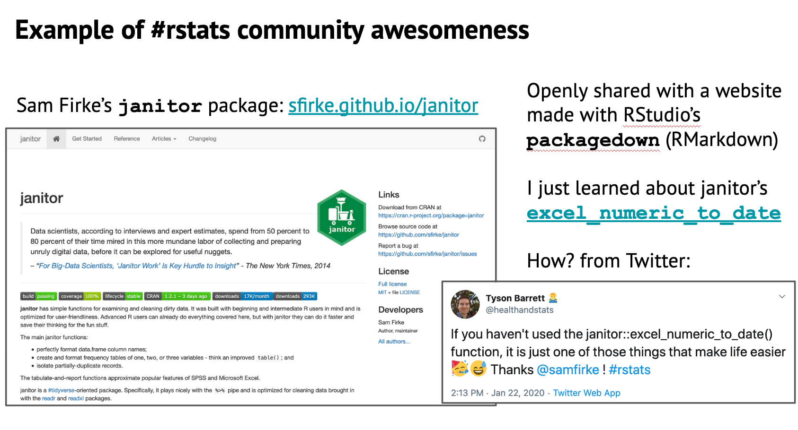
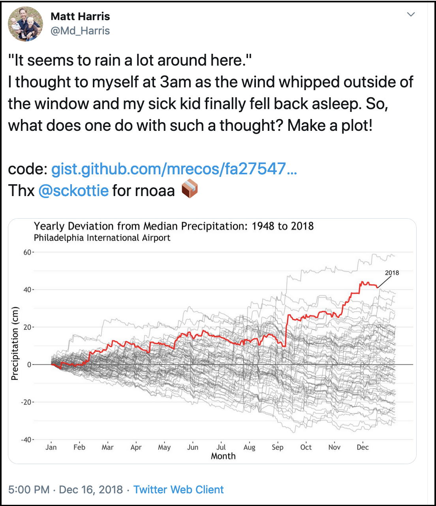
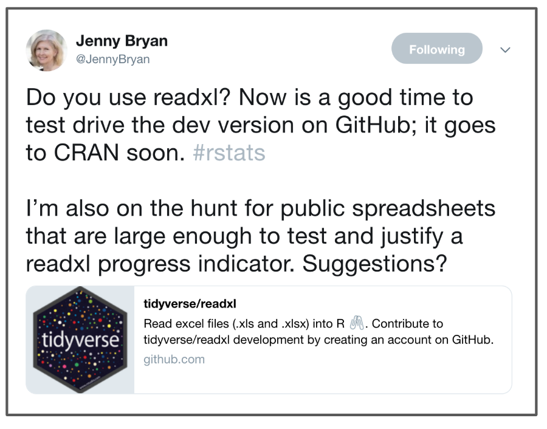
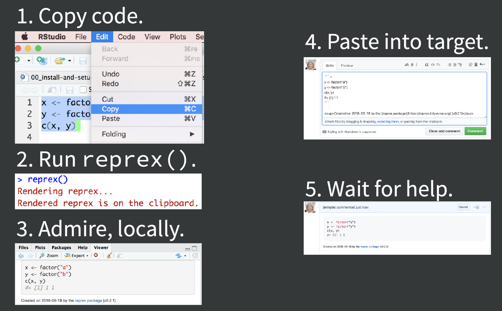
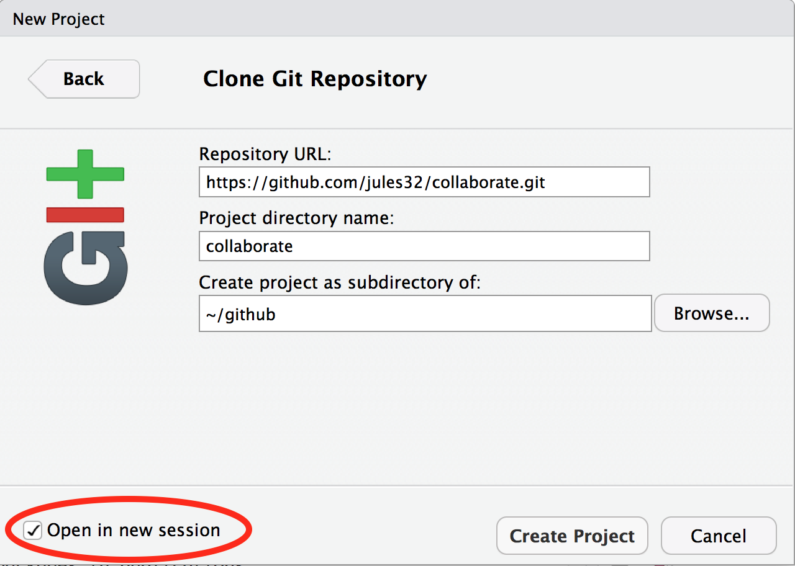
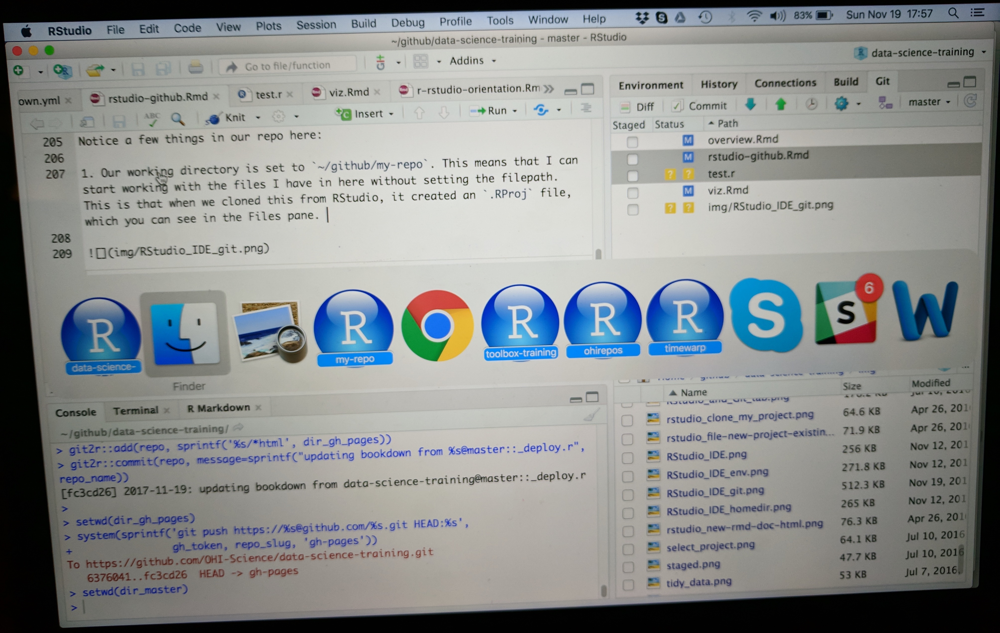
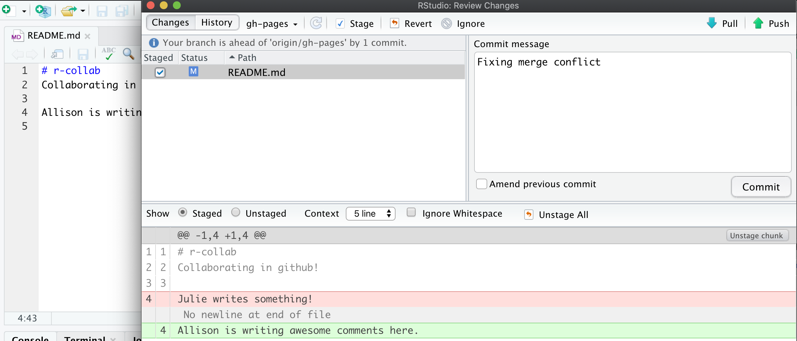
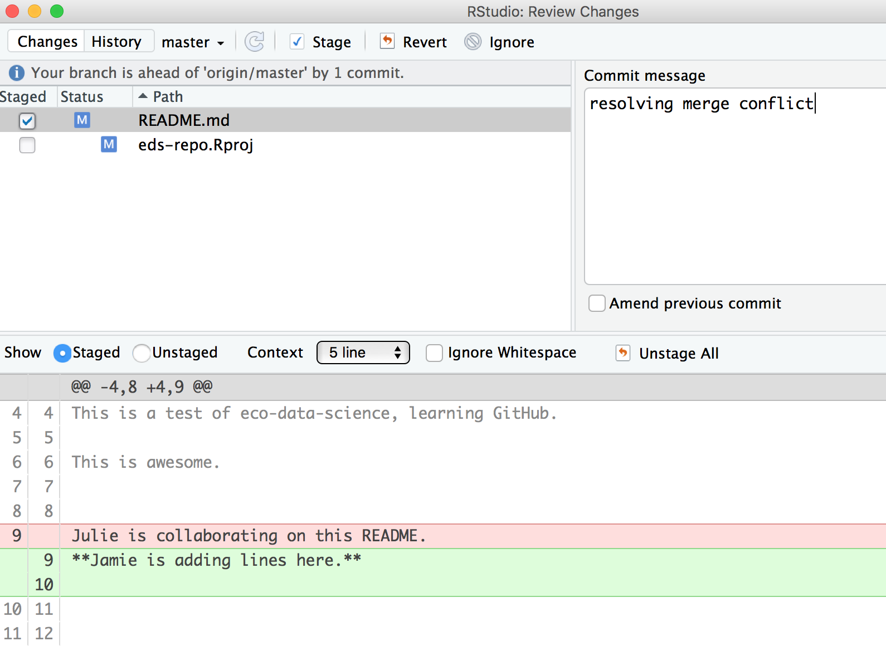

# Collaborating & getting help {#collaborating}

## Summary

Since the GitHub session (Chapter \@ref(github)), we have been practicing using GitHub with RStudio to collaborate with our most important collaborator: Future You. 

Here we will practice using GitHub with RStudio to collaborate with others now, with a mindset towards Future Us (your colleagues that you know and have yet to meet). We will also how to engage with the #rstats community, including how to engage on Twitter, and how to ask for help.

We are going to teach you the simplest way to collaborate with someone, which is for both of you to have privileges to directly edit and add files to a repository. GitHub is built for software developer teams, and there is a lot of features that limit who can directly edit files (which lead to "pull requests"), but we won't cover that today. 

### Objectives

- intro to R communities
- How to effectively ask for help
  - Googling. Error messages are your friends
  - How to use Twitter for #rstats
  - Create a reproducible example with `reprex`
- create a new repo and give permission to a collaborator 
- publish webpages online


### Resources

- [ESM 206 Intro to data science & stats](https://allisonhorst.github.io), specifically [ESM Lecture 2](https://docs.google.com/presentation/d/1u1DdhU_WTv1b-sbQgqVGAE-bA2Nq_Yym8BzcPW4lS3k/edit#slide=id.g63942ead2d_0_219) - by Allison Horst
-  [Finding the YOU in the R community](https://github.com/jthomasmock/presentations/blob/master/r-community2.pdf) - by Thomas Mock
- [reprex.tidyverse.org](https://reprex.tidyverse.org/)
- [Reprex webinar](https://resources.rstudio.com/webinars/help-me-help-you-creating-reproducible-examples-jenny-bryan) - by Jenny Bryan
- [Getting help in R: do as I say, not as I've done](https://sctyner.github.io/rhelp.html) by Sam Tyner
- [Making free websites with RStudio’s R Markdown](https://jules32.github.io/rmarkdown-website-tutorial/) - by Julie Lowndes


<!---openscapes slides: 
https://docs.google.com/presentation/d/1ZYQERUuNJ69QRSUs_JKLdask_VnQRmvMTulv6m2VmUU/edit#slide=id.g58b639860e_0_17
--->


## R communities 

We are going to start off by talking about communities that exist around R and how you can engage with them. 

R communities connect online and in person. And we use Twitter as a platform to connect with each other. Yes, Twitter is a legit tool for data science. Most communities have some degree of in-person and online presence, with Twitter being a big part of that online presence, and it enables you to talk directly with people. On Twitter, we connect using the \#rstats hashtag, and thus often called the "rstats community" (more on Twitter in a moment).

This is a small (and incomplete!) sampling to give you a sense of a few communities. Please see Thomas Mock's presentation [Finding the YOU in the R community](https://github.com/jthomasmock/presentations/blob/master/r-community2.pdf) for more details.

#### RStudio Community

```{r, echo=FALSE, out.width="30%"}
knitr::include_graphics("img/rstudio_logo.png")  
```

What is it: Online community forum for all questions R & RStudio

Location: online at [community.rstudio.com](https://community.rstudio.com>)

Also: [RStudio](https://twitter.com/rstudio) on Twitter

#### RLadies

```{r, echo=FALSE, out.width="30%"}
knitr::include_graphics("img/rladies-logo.png")  
```

RLadies is a world-wide organization to promote gender diversity in the R community. 

Location: online at [rladies.org](https://rladies.org/), on Twitter at [rladiesglobal](https://twitter.com/rladiesglobal)  

Also: [WeAreRLadies](https://twitter.com/WeAreRLadies)  


#### rOpenSci

```{r, echo=FALSE, out.width="30%"}
  
```

What is it: rOpenSci builds software with a community of users and developers, and educate scientists about transparent research practices.

Location: online at [ropensci.org](https://ropensci.org/), on Twitter at [ropensci](https://twitter.com/ropensci)  

Also: [roknowtifier](https://twitter.com/roknowtifier), [rocitations](https://twitter.com/rocitations)


#### R User Groups

```{r, echo=FALSE, out.width="30%"}
knitr::include_graphics("img/la_rusers.jpg")  
```

What is it: R User Groups ("RUGs") are in-person meetups supported by [The R Consortium](https://www.r-consortium.org/projects/r-user-group-support-program). 

Location: local chapters. See a [list of RUGs and conferences](https://jumpingrivers.github.io/meetingsR/r-user-groups.html).

Also: example: [Los Angeles R Users Group](https://twitter.com/la_rusers)

#### The Carpentries

```{r, echo=FALSE, out.width="30%"}
  
```

What is it: Network teaching foundational data science skills to researchers worldwide

Location: online at [carpentries.org](https://carpentries.org), on Twitter at [thecarpentries](https://twitter.com/thecarpentries), local workshops worldwide


#### R4DS Community

```{r, echo=FALSE, out.width="30%"}
knitr::include_graphics("img/r4ds_community.jpg")  
```

What is it: A community of R learners at all skill levels working together to improve our skills.

Location: on Twitter: [R4DScommunity](https://twitter.com/R4DScommunity), on Slack — sign up from [rfordatasci.com](https://www.rfordatasci.com/)

Also: [#tidytuesday](https://twitter.com/search?q=%23tidytuesday&src=typed_query), [R4DS_es](https://twitter.com/RFDS_es)


### Community awesomeness

Example with Sam Firke's janitor package: [sfirke.github.io/janitor](http://sfirke.github.io/janitor/), highlighting the [`excel_numeric_to_date`](http://sfirke.github.io/janitor/reference/excel_numeric_to_date.html) function and learning about it through Twitter. 

```{r, echo=FALSE, out.width="100%"}
  
```


## How to use Twitter for \#rstats

Twitter is how we connect with other R users, learn from each other, develop together, and become friends. Especially at an event like RStudio::conf, it is a great way to stay connect and stay connected with folks you meet. 

Twitter is definitely a firehose of information, but if you use it deliberately, you can hear the signal through the noise.

I was super skeptical of Twitter. I thought it was a megaphone for angry people. But it turns out it is a place to have small, thoughtful conversations and be part of innovative and friendly communities. 

### Examples

Here are a few examples of how to use Twitter for #rstats. 

<br>

```{r, echo=FALSE, out.width="100%"}
  
```

<br>

When I saw [this tweet](https://twitter.com/Md_Harris/status/1074469302974193665/photo/1) by [Md_Harris](https://twitter.com/Md_Harris), this was my internal monologue: 

1. Cool visualization!
1. I want to represent my data this way
1. He includes his [code](https://gist.github.com/mrecos) that I can look at to understand what he did, and I can run and remix
1. The package is from [sckottie](https://twitter.com/sckottie) — who I know from [rOpenSci](https://ropensci.org), which is a really amazing software developer community for science
1. [`rnoaa`](https://cran.r-project.org/web/packages/rnoaa/index.html) is a package making NOAA [US environmental] data more accessible! I didn't know about this, it will be so useful for my colleagues
1. I will retweet so my network can benefit as well

<br>

Another example, [this tweet](https://twitter.com/JennyBryan/status/1074339217986138113) where [JennyBryan](https://twitter.com/JennyBryan/) is asking for feedback on a super useful package for interfacing between R and excel: [`readxl`](https://readxl.tidyverse.org/).

<br>

```{r, echo=FALSE, out.width="60%"}
  
```

<br>


My internal monologue: 

1. Yay, `readxl` is awesome, and also getting better thanks to Jenny
1. Do I have any spreadsheets to contribute? 
1. In any case, I will retweet so others can contribute. And I'll like it too because I appreciate this work

### How to Twitter

My advice for Twitter is to start off small and deliberately. Curate who you follow and start by listening. I use Twitter deliberately for R and science communities, so that is the majority of the folks I follow (but of course I also follow [Mark Hamill](https://twitter.com/HamillHimself).

So start using Twitter to listen and learn, and then as you gradually build up courage, you can like and retweet things. And remember that liking and retweeting is not only a way to engage with the community yourself, but it is also a way to welcome and amplify other people. Sometimes I just reply saying how cool something is. Sometimes I like it. Sometimes I retweet. Sometimes I retweet with a quote/comment. But I also miss a lot of things since I limit how much time I give to Twitter, and that's OK. You will always miss things but you are part of the community and they are there for you like you are for them.   

If you're joining twitter to learn R, I suggest following:

- [hadleywickham](https://twitter.com/hadleywickham) 
- [JennyBryan](https://twitter.com/JennyBryan)
- [rOpenSci](https://twitter.com/ropensci)
- [WeAreRLadies](https://twitter.com/https://twitter.com/WeAreRLadies)

Listen to what they say and who joins those conversations, and follow other people and organizations. You could also look at who they are following. Also, check out the [#rstats](https://twitter.com/search?q=%23rstats&src=typed_query) hashtag. This is not something that you can follow (although you can have it as a column in software like TweetDeck), but you can search it and you'll see that the people you follow use it to help tag conversations. You'll find other useful tags as well, within your domain, as well as other R-related interests, e.g. [#rspatial](https://twitter.com/search?q=%23rspatial&src=typed_query). When I read marine science papers, I see if the authors are on Twitter; I sometimes follow them, ask them questions, or just tell them I liked their work!

You can also follow us: 

- [juliesquid](https://twitter.com/juliesquid)
- [allison_horst](https://twitter.com/allison_horst)
- [jamiecmonty](https://twitter.com/jamiecmonty)
- [ECOuture9](https://twitter.com/ECOuture9)

These are just a few ways to learn and build community on Twitter. And as you feel comfortable, you can start sharing your ideas or your links too. Live-tweeting is a really great way to engage as well, and bridge in-person conferences with online communities. And of course, in addition to engaging on Twitter, check whether there are local RLadies chapters or other R meetups, and join! Or perhaps [start one](https://openscapes.org/blog/2018/11/16/how-to-start-a-coding-club/)?

So Twitter is a place to engage with folks and learn, and while it is also a place to ask questions, there are other places to look first, depending on your question. 

## Getting help

Getting help, or really helping you help yourself, means moving beyond "it's not working" and towards solution-oriented approaches. Part of this is the mindset where you **expect that someone has encountered this problem before** and that **most likely the problem is your typo or misuse**, and not that R is broken or hates you. 

We're going to talk about how to ask for help, how to interpret responses, and how to act upon the help you receive.

### Read the error message

As we've talked about before, they may be red, they may be unfamiliar, but **error messages are your friends**. There are multiple types of messages that R will print. Read the message to figure out what it’s trying to tell you. 

**Error:** There’s a fatal error in your code that prevented it from being run through successfully. You need to fix it for the code to run. 

**Warning:** Non-fatal errors (don’t stop the code from running, but this is a potential problem that you should know about).

**Message:** Here’s some helpful information about the code you just ran (you can hide these if you want to)


### Googling

The internet has the answer to all of your R questions, hopes, and dreams.  

When you get an error you don't understand, copy it and paste it into Google. You can also add "rstats" or "tidyverse" or something to help Google (although it's getting really good without it too). 

For error messages, copy-pasting the exact message is best. But if you have a "how do I...?" type question you can also enter this into Google. You'll develop the vocabulary you need to refine your search terms as you become more familiar with R. It's a continued learning process.

And just as important as Googling your error message is being able to identify a useful result. 

Something I can't emphasize enough: **pay attention to filepaths**. They tell you the source, they help you find pages again. Often remembering a few things about it will let you either google it again or navigate back there yourself.

**Check the date, check the source, check the relevance.** Is this a modern solution, or one from 2013? Do I trust the person responding? Is this about my question or on a different topic?

You will see links from many places, particularly: 

- RStudio Community 
- Stack Overflow
- Books, blogs, tutorials, courses, webinars
- GitHub Issues

<!---TODO
#### Google example

--->

### Create a reprex

A "reprex" is a REPRoducible EXample: code that you need help with and want to ask someone about. 

Jenny Bryan made the `reprex` package because "conversations about code are more productive with code that ***actually runs***, that ***I don’t have to run***, and that ***I can easily run***".

Let me demo an example, and then you will do it yourself. This is Jenny's summary from her [reprex webinar](https://resources.rstudio.com/webinars/help-me-help-you-creating-reproducible-examples-jenny-bryan) of what I'll do:

<br>

```{r, echo=FALSE, out.width="80%"}
  
```

`reprex` is part of the Tidyverse, so we all already have it installed, but we do need to attach it: 

```{r reprex-attach}
library(reprex)
```

First let me create a little example that I have a question about. I want to know how I change the color of the geom_points in my ggplot. (Reminder: this example is to illustrate reprex, not how you would actually look in the help pages!!!) 

I'll type into our RMarkdown script: 

```{r, eval=FALSE}
library(tidyverse)
ggplot(cars, aes(speed, dist)) +
  geom_point()
```

So this is the code I have a question about it. My next step is to select it all and copy it into my clipboard. 
 
Then I go to my Console and type:

```{r, eval=FALSE}
reprex()
```
 
Reprex does its thing, making sure this is a reproducible example — this wouldn't be without `library(tidyverse)`! — and displaying it in my Viewer on the bottom-right of the RStudio IDE.
 

reprex includes the output — experienced programmers who you might be asking for help can often read your code and know where the problem lies, especially when they can see the output.
 
When it finishes I also have what I see in the Viewer copied in my clipboard. I can paste it anywhere! In an email, Google Doc, in Slack. I'm going to paste mine in an Issue for my r-workshop repository.

When I paste it: 

```{r, echo=FALSE, out.width="100%"}
knitr::include_graphics("img/reprex-ex-ggplot.png")  
```

Notice that following the backticks, there is only `r`, not `r{}`. This is because what we have pasted is so GitHub can format as R code, but it won't be executed by R through RMarkdown.

I can click on the Preview button in the Issues to see how this will render: and it will show my code, nicely formatted for R. 

So in this example I might write at the top of the comment: "Practicing a reprex and Issues.  "allison_horst how do I change the point color to cyan?" 

**`reprex` is a "workflow package"**. That means that it's something we don't put in Rmds, scripts, or anything else. We use is in the Console when we are preparing to ask for help — from ourselves or someone else. 


### Activity

Make a reprex using the built-in `mtcars` dataset and paste it in the Issues for your repository. (Have a look: `head(mtcars); skimr::skim(mtcars)`)

1. install and attach the `reprex` package 
1. For your reprex: take the `mtcars` dataset and then filter it for observations where  `mpg` is more than 26. 

1. Navigate to github.com/your_username/r-workshop/issues

Hint: remember to read the error message. "could not find function `%>%`" means you've forgotten to attach the appropriate package with `library()`

#### Solution (no peeking)

```{r activity-solution, eval=FALSE}
## setup: run in Rmd or Console
library(reprex)

## reprex code: run in Rmd or Console
library(tidyverse) # or library(dplyr) or library(magrittr)
mtcars %>% filter(mpg > 26)

## copy the above

## reprex call: run in Console
reprex()

## paste in Issue!
```


## Collaborating with GitHub

Now we're going to collaborate with a partner and set up for our last session, which will tie together everything we've been learning.

### Create repo (Partner 1)

Team up with a partner sitting next to you. Partner 1 will create a new repository. We will do this in the same way that we did in Chapter \@ref(github): [Create a repository on Github.com]. 

Let's name it `r-collab`. 

### Create a gh-pages branch (Partner 1)

We aren't going to talk about branches very much, but they are a powerful feature of git/GitHub. I think of it as creating a copy of your work that becomes a parallel universe that you can modify safely because it's not affecting your original work. And then you can choose to merge the universes back together if and when you want. By default, when you create a new repo you begin with one branch, and it is named `master`. When you create new branches, you can name them whatever you want. However, if you name one `gh-pages` (all lowercase, with a `-` and no spaces), this will let you create a website. And that's our plan. So, Partner 1, do this to create a `gh-pages` branch: 

On the homepage for your repo on GitHub.com, click the button that says "Branch:master". Here, you can switch to another branch (right now there aren't any others besides `master`), or create one by typing a new name. 


<br>

Let's type `gh-pages`. 

<br>

 

Let's also change `gh-pages` to the default branch and delete the master branch: this will be a one-time-only thing that we do here: 

First click to control branches:

 

And then click to change the default branch to `gh-pages`. I like to then delete the `master` branch when it has the little red trash can next to it. It will make you confirm that you really want to delete it, which I do!

 


### Give your collaborator privileges (Partner 1 and 2)

Now, Partner 1, go into Settings > Collaborators > enter Partner 2's (your collaborator's) username. 

Partner 2 then needs to check their email and accept as a collaborator. Notice that your collaborator has "Push access to the repository" (highlighted below):

```{r, echo=FALSE, out.width="80%"}
knitr::include_graphics("img/gh_collab.png")  
```

### Clone to a new R Project  (Partner 1)

Now let's have Partner 1 clone the repository to their local computer. We'll do this through RStudio like we did before (see Chapter \@ref(github): [Clone your repository using RStudio]), but with a final additional step before hitting "Create Project": select "Open in a new Session".

<br>

 

<br>
<br>
Opening this Project in a new Session opens up a new world of awesomeness from RStudio. Having different RStudio project sessions allows you to keep your work separate and organized. So you can collaborate with this collaborator on this repository while also working on your other repository from this morning. I tend to have a lot of projects going at one time:

<br>



<br>

Have a look in your git tab. 

Like we saw this morning, when you first clone a repo through RStudio, RStudio will add an `.Rproj` file to your repo. And if you didn't add a `.gitignore` file when you originally created the repo on GitHub.com, RStudio will also add this for you. So, Partner 1, let's go ahead and sync this back to GitHub.com. 

Remember: 


<br> 

Let's confirm that this was synced by looking at GitHub.com again. You may have to refresh the page, but you should see this commit where you added the `.Rproj` file.

### Clone to a new R Project (Partner 2)

Now it's Partner 2's turn! Partner 2, clone this repository following the same steps that Partner 1 just did. When you clone it, RStudio should not create any new files — why? Partner 1 already created and pushed the `.Rproj` and `.gitignore` files so they already exist in the repo.  

### Create data folder (Partner 2)

Partner 2, let's create a folder for our data and copy our `noaa_landings.csv` there. 

And now let's sync back to GitHub: Pull, Stage, Commit, Push

When we inspect on GitHub.com, click to view all the commits, you'll see commits logged from both Partner 1 and 2!

> Question: Would you still be able clone a repository that you are not a collaborator on? What do you think would happen? Try it! Can you sync back? 

### State of the Repository

OK, so where do things stand right now? GitHub.com has the most recent versions of all the repository's files. Partner 2 also has these most recent versions locally. How about Partner 1? 

Partner 1 does not have the most recent versions of everything on their computer. 

Question: How can we change that? Or how could we even check? 

Answer: PULL. 

Let's have Partner 1 go back to RStudio and Pull. If their files aren't up-to-date, this will pull the most recent versions to their local computer. And if they already did have the most recent versions? Well, pulling doesn't cost anything (other than an internet connection), so if everything is up-to-date, pulling is fine too. 

I recommend pulling every time you come back to a collaborative repository. Whether you haven't opened RStudio in a month or you've just been away for a lunch break, pull. It might not be necessary, but it can save a lot of heartache later.

## Merge conflicts

What kind of heartache are we talking about? Merge conflicts. 

Within a file, GitHub tracks changes line-by-line. So you can also have collaborators working on different lines within the same file and GitHub will be able to weave those changes into each other -- that's it's job! 

It's when you have collaborators working on *the same lines within the same file* that you can have **merge conflicts**. This is when there is a conflict within the same line so that GitHub can't merge automatically. They need a human to help decide what information to keep (which is good because you don't want GitHub to decide for you). Merge conflicts can be frustrating, but like R's error messages, they are actually trying to help you. 

So let's experience this together: we will create and solve a merge conflict. **Stop and watch me demo how to create and solve a merge conflict with my Partner 2, and then you will do the same with your partner.** Here's what I am going to do:

### Pull (Partners 1 and 2)

Both partners go to RStudio and pull so you have the most recent versions of all your files. 

### Create a conflict (Partners 1 and 2)

Now, Partners 1 and 2, both go to the README.md, and on Line 4, write something, anything. Save the README. 

I'm not going to give any examples because when you do this I want to be sure that both Partners to write something different. Save the README. 

### Sync (Partner 2)

OK. Now, let's have Partner 2 sync: pull, stage, commit, push. Just like normal. 

Great. 

### Sync attempts & fixes (Partner 1)

Now, let's have Partner 1 (me) try. 

When I try to Pull, I get the first error we will see today: "Your local changes to README.md would be overwritten by merge". GitHub is telling me that it knows I've modified my README, but since I haven't staged and committed them, it can't do its job and merge my conflicts with whatever is different about the version from GitHub.com. 

This is good: the alternative would be GitHub deciding which one to keep and it's better that we have that kind of control and decision making.

<br>


```{r merge-conflict-img, echo=FALSE, out.width="80%"}
knitr::include_graphics("img/github_mergeconflict.png")  
```

<br>

GitHub provides some guidance: either commit this work first, or "stash it", which you can  interpret that as moving the README temporarily to another folder somewhere outside of this GitHub repository so that you can successfully pull and then decide your next steps. 

Let's follow their advice and have Partner 1 commit. Great. Now let's try pulling again. 

New error: "Merge conflict in README...fix conflicts and then commit the result". 

So this error is different from the previous: GitHub knows what has changed line-by-line in my file here, and it knows what has changed line-by-line in the version on GitHub.com. And it knows there is a conflict between them. So it's asking me to now compare these changes, choose a preference, and commit. 

**Note:** if Partner 2 and I were not intentionally in this demo editing exactly the same lines, GitHub likely could have done its job and merged this file successfully after our first error fix above.

<br>

```{r merge-conflict-img2, echo=FALSE, out.width="80%"}
knitr::include_graphics("img/gh_mergeconflict2.png")  
```

<br>

We will again follow GitHub's advice to fix the conflicts. Let's close this window and inspect. 
Did you notice two other things that happened along with this message? 

First< in the Git tab, next to the README listing there are orange `U`s; this means that there is an unresolved conflict. It means my file is not staged with a check anymore because modifications have occurred to the file since it has been staged. 

Second, the README file itself changed; there is new text and symbols. (We got a preview in the diff pane also). 

```r
<<<<<<< HEAD
Julie is collaborating on this README.
=======
**Allison is adding text here.**
>>>>>>> 05a189b23372f0bdb5b42630f8cb318003cee19b
```

In this example, Partner 1 is Julie and Partner 2 is Allison. GitHub is displaying the line that Julie wrote and the line Allison. wrote separated by `=======`. These are the two choices that I (Partner 1) has to decide between, which one do you want to keep? Where where does this decision start and end? The lines are bounded by `<<<<<<<HEAD` and `>>>>>>>long commit identifier`. 

So, to resolve this merge conflict, Partner 1 has to chose which one to keep. And I tell GitHub my choice by deleting everything in this bundle of tex except the line they want. So, Partner 1 will delete the `<<<<<<HEAD`, `=====`, `>>>>long commit identifier` and either Julie or Allison's line that I don't want to keep. 

I'll do this, and then commit again. In this example, we've kept Allison's line: 


<br>

```{r merge-conflict-img3, echo=FALSE, out.width="80%"}
  
```

<br>

Then I'll stage, and write a commit message. I often write "resolving merge conflict" or something similar. When I stage the file, notice how now my edits look like a simple line replacement (compare with the image above before it was re-staged): 

<br>

```{r merge-conflict-img4, echo=FALSE, out.width="80%"}
  
```

<br>

And we're done! We can inspect on GitHub.com that I am the most recent contributor to this repository. And if we look in the commit history we will see both Allison and my original commits, along with our merge conflict fix. 

### Activity

Create a merge conflict with your partner, following the steps that we just did in the demo above. Practice different approaches to solving errors: for example, try stashing instead of committing. 

### How do you avoid merge conflicts?

Merge conflicts can occur when you collaborate with others — I find most often it is collaborating with ME from a different computer. They will happen, but you can minimize them by getting into good habits. 

To minimize merge conflicts, pull often so that you are aware of anything that is different, and deal with it early. Similarly, commit and push often so that your contributions do not become too unweildly for yourself or others later on.

Also, talk with your collaborators. Are they working on the exact same file right now that you need to be? If so, coordinate with them (in person, GChat, Slack, email). For example: "I'm working on X part and will push my changes before my meeting — then you can work on it and I'll pull when I'm back". Also, if you find yourself always working on the exact same file, you could consider breaking it into different files to minimize problems.

But merge conflicts will occur and some of them will be heartbreaking and demoralizing. They happen to me when I collaborate with myself between my work computer and laptop. We demoed small conflicts with just one file, but they can occur across many files, particularly when your code is generating figures, scripts, or HTML files. Sometimes the best approach is the [burn it all down method](https://happygitwithr.com/burn.html), where you delete your local copy of the repo and re-clone. 

Protect yourself by pulling and syncing often! 

## Create your collaborative website

OK. Let's have both Partners create a new RMarkdown file and name it `my_name_fisheries.Rmd`. Here's what you will do: 

1. Pull
1. Create a new RMarkdown file **and name it `my_name_fisheries.Rmd`**. Let's do it all lowercase. These will become pages for our website
1. We'll start by testing: let's simply change the title inside the Rmd, call it "My Name's Fisheries Analysis"
1. Knit
1. Save and sync your .Rmd and your .html files 
    - (pull, stage, commit, push)
1. Go to Partner 1's repo, mine is <https://github.com/jules32/r-collab/>
1. GitHub also supports this as a website (because we set up our gh-pages branch)
Where is it? Figure out your website's url from your github repo's url — pay attention to urls.    - note that the url starts with my **username.github.io**   
   - my github repo: <https://github.com/jules32/r-collab/>
   - my website url: <https://jules32.github.io/r-collab/>
   - right now this displays the README as the "home page" for our website. 
1. Now navigate to your web page! For example: 
    - my github repo: <https://github.com/jules32/r-collab/julie_fisheries>
    - my website url: <https://jules32.github.io/r-collab/julie_fisheries>
    
    
> ***ProTip*** Pay attention to URLs. An unsung skill of the modern analyst is to be able to navigate the internet by keeping an eye on patterns.
    
So cool!     

You and your partner have created individual webpages here, but they do not talk to each other (i.e. you can't navigate between them or even know that one exists from the other). We will not organize these pages into a website today, but you can practice this on your own with this hour-long tutorial: [Making free websites with RStudio’s R Markdown](https://jules32.github.io/rmarkdown-website-tutorial/). 

> **Aside:** On websites, if something is called `index.html`, that defaults to the home page. So <https://jules32.github.io/r-collab/> is the same as <https://jules32.github.io/r-collab/index.html>. So as you think about building websites you can develop your index.Rmd file rather than your README.md as your homepage.

#### Troubleshooting

- 404 error? Remove trailing / from the url 
- Wants you to download? Remove trailing .Rmd from the url

<!---
## Issues for project management

TODO: 
[openscapes gh for project mgmt](https://docs.google.com/presentation/d/1JGFnZqz01Ex8h2qO3OBUHc1OiTFkAqV2ED2XFiMdN4I/edit#slide=id.g508ea9b321_0_58)

How to use Issues chapter: https://openscapes.github.io/series/github-issues

Now let's have another look at issues. In addition to asking for help, Issues are a great tool for project management: they are a way to communicate to others about plans for the repo, questions, etc. Note that issues are public if the repository is public.


Let's create a new issue with the title "Fisheries analysis". 

In the text box, let's write a note to our collaborator. You can use Markdown in this text box, which means all of your header and bullet formatting will come through. You can also select these options by clicking them just above the text box. 

Let's have one of you write something here. I'm going to write: 

```
Hi @allison_horst! 

# first priority

- import fisheries data
- plot interesting things
```

Note that I have my collaborator's GitHub name with a `@` symbol. This is going to email her directly so that she sees this issue. I can click the "Preview" button at the top left of the text box to see how this will look rendered in Markdown. It looks good! 

Now let's click submit new issue. 

On the right side, there are a bunch of options for categorizing and organizing your issues. You and your collaborator may want to make some labels and timelines, depending on the project. 

Another feature about issues is whether you want any notifications to this repository. Click where it says "Unwatch" up at the top. You'll see three options: "Not watching", "Watching", and "Ignoring". By default, you are watching these issues because you are a collaborator to the repository. But if you stop being a big contributor to this project, you may want to switch to "Not watching". Or, you may want to ask an outside person to watch the issues. Or you may want to watch another repo yourself!

Let's have Person 2 respond to the issue affirming the plan.

--->

### END **collaborating** session!

