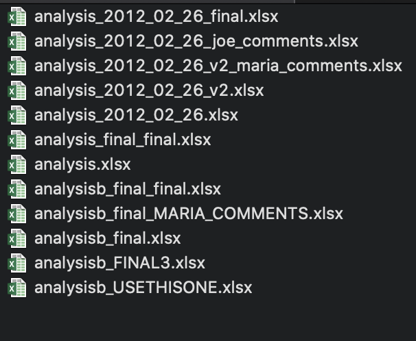
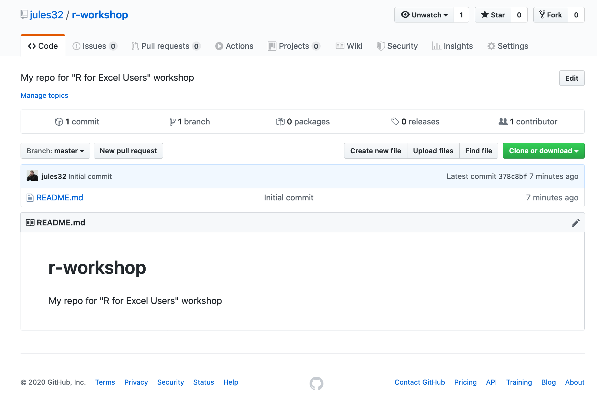
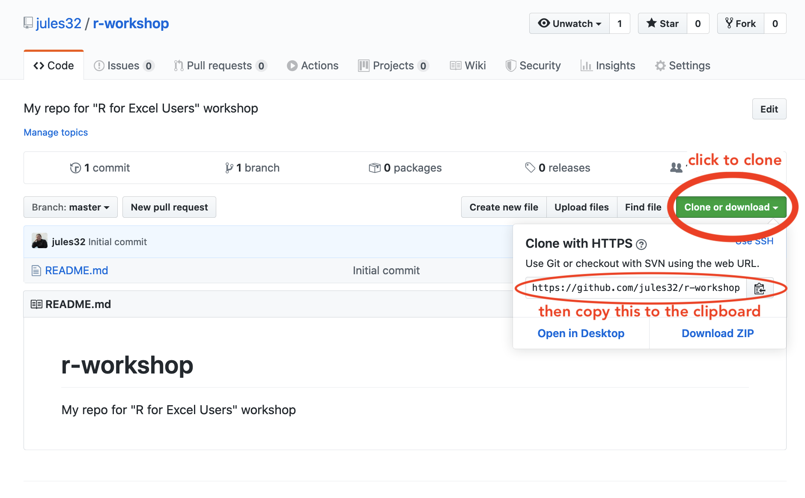
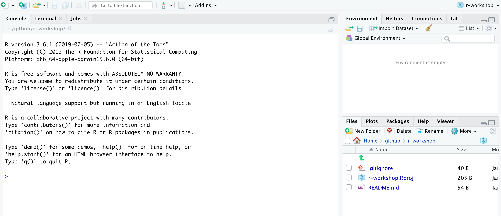
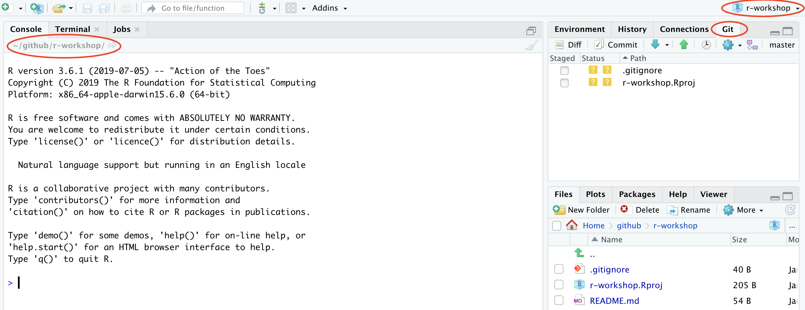
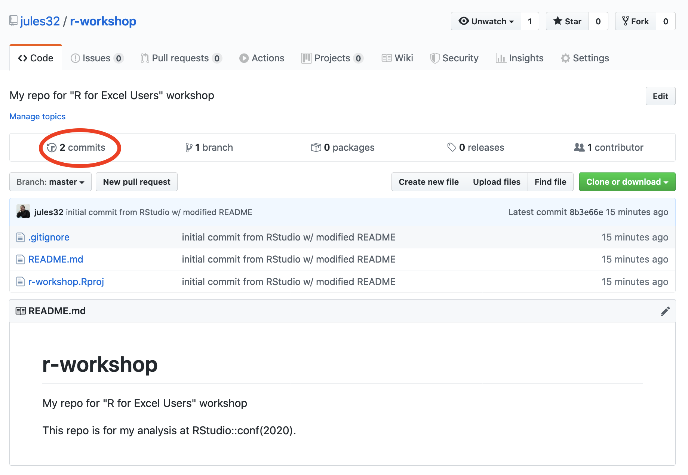
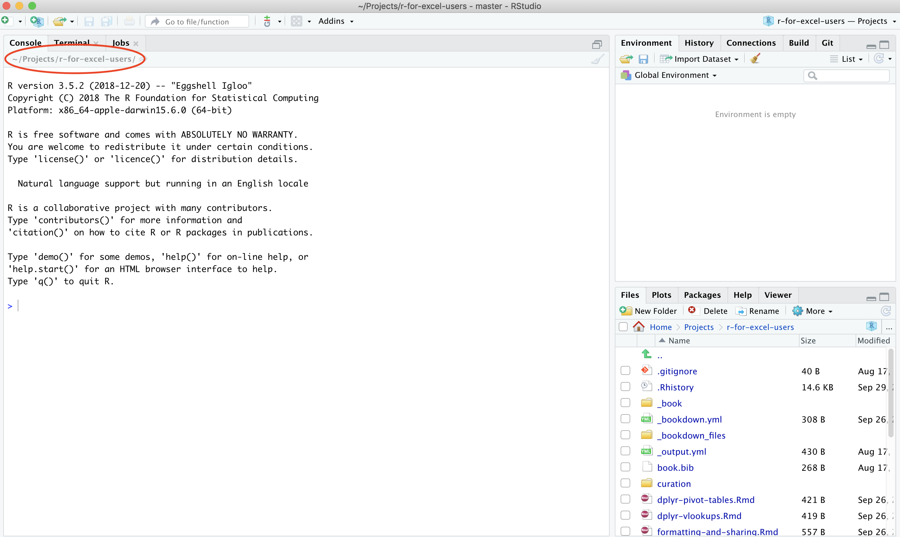

# GitHub {#github}

```{r gh ops, include=FALSE}
knitr::opts_chunk$set(echo = TRUE)
library(htmltools)
```

## Summary 

We will learn about version control and practice a workflow with GitHub and RStudio that streamlines working with our most important collaborator: Future You. 

### Objectives

Today, we'll interface with GitHub from our local computers using RStudio. 

> **Aside**: There are many other ways to interact with GitHub, including GitHub's Desktop App and the command line ([here is Jenny Bryan's list of git clients](http://stat545.com/git02_git-clients.html)). You have the largest suite of options if you interface through the command line, but the most common things you'll do can be done through one of these other applications (i.e. RStudio).

Here's what we'll do, since we've already set up git on your computers in the previous session (Chapter \@ref(github)): 

1. create a repository on Github.com (remote)
1. clone locally using RStudio 
1. sync local to remote: pull, stage, commit, push
1. explore github.com files, commit history, README
1. project-oriented workflows
1. project-oriented workflows in action

### Resources

- [Excuse me, do you have a moment to talk about version control?](https://peerj.com/preprints/3159/) by Jenny Bryan
- [Happy Git with R](http://happygitwithr.com/) by Jenny Bryan, specifically [Detect Git from RStudio](http://happygitwithr.com/rstudio-see-git.html)
- [What They Forgot to Teach You About R](https://rstats.wtf/) by Jenny Bryan, specifically [Project-oriented workflows](https://rstats.wtf/project-oriented-workflow.html)  
- [GitHub Quickstart](https://rawgit.com/nazrug/Quickstart/master/GithubQuickstart.html) by Melanie Frazier 
- [GitHub for Project Management](https://openscapes.github.io/series/github-issues.html) by Openscapes

## Why should R users use Github?

Modern R users use GitHub because it helps make coding collaborative and social while also providing huge benefits to organization, archiving, and being able to find your files easily when you need them.

One of the most compelling reasons for me is that it ends (or nearly ends) the horror of keeping track of versions.

Basically, we get away from this: 

<br>

```{r, echo=FALSE, out.width="80%"}
  
```
<br>

This is a nightmare not only because I have NO idea which is truly the version we used in that analysis we need to update, but because it is going to take a lot of detective work to see what actually changed between each file. Also, it is very sad to think about the amount of time everyone involved is spending on bookkeeping: is everyone downloading an attachment, dragging it to wherever they organize this on their own computers, and then renaming everything? Hours and hours of all of our lives. 

But then there is GitHub. 

In GitHub, in this example you will likely only see a single file, which is the most recent version. GitHub's job is to track who made any changes and when (so no need to save a copy with your name or date at the end), and it also requires that you write something human-readable that will be a breadcrumb for you in the future. It is also designed to be easy to compare versions, and you can easily revert to previous versions. 

GitHub also supercharges you as a collaborator. First and foremost with Future You, but also sets you up to collaborate with Future Us!

GitHub, especially in combination with RStudio, is also game-changing for publishing and distributing. You can — and we will — publish and share files openly on the internet. 

### What is Github? And Git?

OK so what is GitHub? And Git? 

- **Git** is a program that you install on your computer: it is version control software that tracks changes to your files over time.

- **Github** is an website that is essentially a social media platform for your git-versioned files. GitHub stores all your versioned files as an archive, but also as allows you to interact with other people's files and has management tools for the social side of software projects. It has many nice features to be able visualize differences between [images](https://help.github.com/articles/rendering-and-diffing-images/), [rendering](https://help.github.com/articles/mapping-geojson-files-on-github/) & [diffing](https://github.com/blog/1772-diffable-more-customizable-maps) map data files, [render text data files](https://help.github.com/articles/rendering-csv-and-tsv-data/), and [track changes in text](https://help.github.com/articles/rendering-differences-in-prose-documents/).

Github was developed for software development, so much of the functionality and terminology of that is exciting for professional programmers (e.g., branches and pull requests) isn't necessarily the right place for us as new R users to get started.  

So we will be learning and practicing GitHub's features and terminology on a "need to know basis" as we start managing our projects with GitHub.

Let's get started by going to <https://github.com> and going to our user profile. You can do this by typing your username in the URL (github.com/username), or after signing in, by clicking on the top-right button and going to your profile. 

This will have an overview of you and your work, and then you can click on the Repository button. 

Repositories are the main "unit" of GitHub: they are what GitHub tracks. They are essentially project-level folders that will contain everything associated with a project. It's where we'll start too. 

<!---
### Some Github terminology

* **User**: A Github account for you (e.g., jules32).
* **Organization**: The Github account for one or more user (e.g., datacarpentry).
* **Repository**: A folder within the organization that includes files dedicated to a project.
* **Local Github**: Copies of Github files located your computer.
* **Remote Github**: Github files located on the https://github.com website.
* **Clone**: Process of making a local copy of a remote Github repository.  This only needs to be done once (unless you mess up your local copy).
* **Pull**: Copy changes on the remote Github repository to your local Github repository.  This is useful if multiple people are making changes to a repository.
* **Push**: Save local changes to remote Github
<br />
<br />

[](img/push_pull_clone.png)
<br />
<br />
--->

## Create a repository on Github.com

We create a new repository (called a "repo") by clicking "New repository".

<br>

```{r, echo=FALSE, out.width="80%"}
knitr::include_graphics("img/gh_repo_create.png")  
```

<br>

Choose a name. Call it whatever you want (the shorter the better), or follow me for convenience. I will call mine `r-workshop`. 

Also, add a description, make it public, create a README file, and create your repo!

<br>

```{r, echo=FALSE, out.width="80%"}
knitr::include_graphics("img/gh_repo_create2.png")  
```

<br>

The *Add gitignore* option adds a document where you can identify files or file-types you want Github to ignore. These files will stay in on the local Github folder (the one on your computer), but will not be uploaded onto the web version of Github.

The *Add a license* option adds a license that describes how other people can use your Github files (e.g., open source, but no one can profit from them, etc.).  We won't worry about this today.

Check out our new repository! 


<br>

```{r, echo=FALSE, out.width="80%"}
  
```

<br>

Great! So now we have our new repository that exists in the Cloud. Let's get it established locally on our computers: that is called "cloning". 

## Clone your repository using RStudio

Let's clone this repo to our local computer using RStudio. Unlike downloading, cloning keeps all the version control and user information bundled with the files. 

### Copy the repo address 

First, copy the web address of the repository you want to clone. We will use HTTPS. 

> **Aside**: HTTPS is default, but you could alternatively set up with SSH. This is more advanced than we will get into here, but allows 2-factor authentication. See [Happy Git with R](https://happygitwithr.com/credential-caching.html#special-consideration-re-two-factor-authentication) for more information.

<br>

```{r, echo=FALSE, out.width="100%"}
  
```

<br>

### RStudio: New Project

Now go back to RStudio, and click on New Project. There are a few different ways; you could also go to File > New Project..., or click the little green + with the R box in the top left.
also in the File menu).

<br>

```{r, echo=FALSE, out.width="80%"}
knitr::include_graphics("img/new_project1.png")  
```

<br>


### Select Version Control

<br>

```{r, echo=FALSE, out.width="80%"}
knitr::include_graphics("img/new_project2.png")  
```

<br>

### Select Git

Since we are using git. 

<br>

```{r, echo=FALSE, out.width="80%"}
knitr::include_graphics("img/new_project3.png")  
```

<br>


### Paste the repo address

Paste the repo address (which is still in your clipboard) into in the "Repository URL" field. The "Project directory name" should autofill; if it does not press *tab*, or type it in. It is best practice to keep the "Project directory name" THE SAME as the repository name.

When cloned, this repository is going to become a folder on your computer. 

At this point you can save this repo anywhere. There are different schools of thought but we think it is useful to create a high-level folder where you will keep your github repos to keep them organized. We call ours `github` and keep it in our root folder (`~/github`), and so that is what we will demonstrate here — you are welcome to do the same. Press "Browse..." to navigate to a folder and you have the option of creating a new folder. 

Finally, click Create Project. 

<br>

```{r, echo=FALSE, out.width="80%"}
knitr::include_graphics("img/new_project4.png")  
```

<br>


### Admire your local repo

If everything went well, the repository will show up in RStudio!

<br>

```{r, echo=FALSE, out.width="100%"}
  
```

<br>

The repository is also saved to the location you specified, and you can navigate to it as you normally would in Finder or Windows Explorer: 

<br>

```{r, echo=FALSE, out.width="80%"}
knitr::include_graphics("img/new_project6.png")  
```

<br>

Hooray!

### Inspect your local repo

Let's notice a few things: 

First, our working directory is set to `~/github/r-workshop`, and `r-workshop` is also named in the top right hand corner.

Second, we have a Git tab in the top right pane! Let's click on it. 

<br>

```{r, echo=FALSE, out.width="80%"}
  
```

<br>

Our Git tab has 2 items:

- .gitignore file
- .Rproj file

These have been added to our repo by RStudio — we can also see them in the File pane in the bottom right of RStudio. These are helper files that RStudio has added to streamline our workflow with GitHub and R. We will talk about these a bit more soon. One thing to note about these files is that they begin with a period (`.`) which means they are hidden files: they show up in the Files pane of RStudio but won't show up in your Finder or Windows Explorer.

Going back to the Git tab, both these files have little yellow icons with question marks `?`. This is GitHub's way of saying: "I am responsible for tracking everything that happens in this repo, but I'm not sure what is going on with these files yet. Do you want me to track them too?" 

We will handle this in a moment; first let's look at the README.md file.

### Edit your README file

Let's also open up the README.md. This is a Markdown file, which is the same language we just learned with R Markdown. It's like an R Markdown file without the abilities to run R code. 

We will edit the file and illustrate how GitHub tracks files that have been modified (to complement seeing how it tracks files that have been added. 

README files are common in programming; they are the first place that someone will look to see why code exists and how to run it. 

In my README, I'll write: 

```
This repo is for my analyses at RStudio::conf(2020). 
```

When I save this, notice how it shows up in my Git tab. It has a blue "M": GitHub is already tracking this file, and tracking it line-by-line, so it knows that something is different: it's Modified with an M. 

Great. Now let's sync back to GitHub in 4 steps. 


## Sync from RStudio (local) to GitHub (remote)

Syncing to GitHub.com means 4 steps: 

1. Pull
1. Stage
1. Commit
1. Push

<br>

```{r, echo=FALSE, out.width="100%"}
knitr::include_graphics("img/commit_steps.png")  
```

<br>

We start off this whole process by clicking on the Commit section. 

<br>

```{r, echo=FALSE, out.width="100%"}
knitr::include_graphics("img/commit_circled.png")  
```

<br>

### Pull 

We start off by "Pulling" from the remote repository (GitHub.com) to make sure that our local copy has the most up-to-date information that is available online. Right now, since we just created the repo and are the only ones that have permission to work on it, we can be pretty confident that there isn't new information available. But we pull anyways because this is a very safe habit to get into for when you start collaborating with yourself across computers or others. Best practice is to pull often: it costs nothing (other than an internet connection). 

Pull by clicking the teal Down Arrow. (Notice also how when you highlight a filename, a preview of the differences displays below).

<br>

```{r, echo=FALSE, out.width="100%"}
knitr::include_graphics("img/commit_pull.png")  
```

<br>

### Stage

Let's click the boxes next to each file. This is called "staging a file": you are indicating that you want GitHub to track this file, and that you will be syncing it shortly. Notice: 

- .Rproj and .gitignore files: the question marks turn into an A because these are new files that have been added to your repo (automatically by RStudio, not by you). 
- README.md file: the M indicates that this was modified (by you)

These are the codes used to describe how the files are changed, (from the RStudio [cheatsheet](http://www.rstudio.com/wp-content/uploads/2016/01/rstudio-IDE-cheatsheet.pdf)):

<br>

```{r, echo=FALSE, out.width="30%"}
knitr::include_graphics("img/commit_codes_added_modified.png")  
```

<br>

### Commit

Committing is different from saving our files (which we still have to do! RStudio will indicate a file is unsaved with red text and an asterix). We commit a single file or a group of files when we are ready to save a snapshot in time of the progress we've made. Maybe this is after a big part of the analysis was done, or when you're done working for the day.

Committing our files is a 2-step process.

First, you write a "commit message", which is a human-readable note about what has changed that will accompany GitHub's non-human-readable alphanumeric code to track our files. I think of commit messages like breadcrumbs to my Future Self: how can I use this space to be useful for me if I'm trying to retrace my steps (and perhaps in a panic?). 

Second, you press Commit. 

<br>

```{r, echo=FALSE, out.width="100%"}
knitr::include_graphics("img/commit_message_arrow.png")  
```

<br>

When we have committed successfully, we get a rather unsuccessful-looking pop-up message. You can read this message as "Congratulations! You've successfully committed 3 files, 2 of which are new!" It is also providing you with that alphanumeric SHA code that GitHub is using to track these files. 

If our attempt was not successful, we will see an Error. Otherwise, interpret this message as a joyous one. 

> Does your pop-up message say "Aborting commit due to empty commit message."? GitHub is really serious about writing human-readable commit messages.

<br>

```{r, echo=FALSE, out.width="100%"}
knitr::include_graphics("img/commit_success.png")  
```

<br>

When we close this window there is going to be (in my opinion) a very subtle indication that we are not done with the syncing process. 

<br>

```{r, echo=FALSE, out.width="100%"}
knitr::include_graphics("img/commit_branch_ahead_of_origin_master.png")  
```

<br>


We have successfully committed our work as a breadcrumb-message-approved snapshot in time, but it still only exists locally on our computer. We can commit without an internet connection; we have not done anything yet to tell GitHub that we want this pushed to the remote repo at GitHub.com. So as the last step, we push. 


### Push

The last step in the syncing process is to Push!

<br>

```{r, echo=FALSE, out.width="100%"}
knitr::include_graphics("img/commit_push.png")  
```

<br>

Awesome! We're done here in RStudio for the moment, let's check out the remote on GitHub.com.

## Commit history

The files you added should be on github.com. 

Notice how the README.md file we created is automatically displayed at the bottom. Since it is good practice to have a README file that identifies what code does (i.e. why it exists), GitHub will display a Markdown file called README nicely formatted.

<br>

```{r, echo=FALSE, out.width="100%"}
  
```

<br>

Let's also explore the commit history. The 2 commits we've made (the first was when we originally initiated the repo from GitHub.com) are there!

## Project-oriented workflows

Let's go back to RStudio and how we set up well-organized projects and workflows for our data analyses. 

This GitHub repository is now also an RStudio Project (capital P Project). This just means that RStudio has saved this additional file with extension `.Rproj` (ours is `r-workshop.Rproj`) to store specific settings for this project. It's a bit of technology to help us get into the good habit of having a project-oriented workflow. 

A [project-oriented workflow](https://rstats.wtf/project-oriented-workflow.html) means that we are going to organize all of the relevant things we need for our analyses in the same place. That means that this is the place where we keep all of our data, code, figures, notes, etc. 

R Projects are great for reproducibility, because our self-contained working directory will be the **first** place R looks for files. 

<!---
Why does this matter? It's convenient for us to have everything associated with our analyses close at-hand.  When we work with different files in R (like data or saved graphs) we always need to tell R where things "live" by identifying its file path. If files are scattered across your computer, we would have to keep track of many different filepaths. So using RStudio Projects and having a project-oriented workflow and mindset makes our analysis less brittle and more portable — across people, time, and computers.  

--->

### Working directory

Now that we have our Project, let's revisit this important question: where are we? Now we are in our Project. Everything we do will by default be saved here so we can be nice and organized. 

And this is important because if Allison clones this repository that you just made and saves it in `Allison/my/projects/way/over/here`, she will still be able to interact with your files as you are here.

```{r, echo=FALSE, out.width="100%"}
  
```

## Project-oriented workflows in action (aka our analytical setup)

Let's get a bit organized. First, let's create our a new R Markdown file where we will do our analyses. This will be nice because you can also write notes to yourself in this document. 

### Create a new Rmd file

So let's do this (again): 

File > New File > R Markdown ... (or click the green plus in the top left corner).

Let's set up this file so we can use it for the rest of the day. I'm going to update the header with a new title and add my name, and then I'm going to delete the rest of the document so that we have a clean start. 

> **Efficiency Tip**: I use Shift - Command - Down Arrow to highlight text from my cursor to the end of the document

```
---
title: "Creating graphs in R with `ggplot2`"
author: "Julie Lowndes"
date: "01/27/2020"
output: html_document
---

# Plots with ggplot2

We are going to make plots in R and it's going to be amazing.

```

Now, let's save it. I'm going to call my file `plots-ggplot.Rmd`. 

Notice that when we save this file, it pops up in our Git tab. Git knows that there is something new in our repo. 

Let's also knit this file. And look: Git also sees the knitted .html. 


And let's practice syncing our file to to GitHub: pull, stage, commit, push

> **Troubleshooting:** What if a file doesn't show up in the Git tab and you expect that it should? Check to make sure you've saved the file. If the filename is red with an asterix, there have been changes since it was saved. Remember to save before syncing to GitHub!

### Create data and figures folders

Let's create a few folders to be organized. Let's have one for our the raw data, and one for the figures we will output. We can do this in RStudio, in the bottom right pane Files pane by clicking the New Folder button: 

* folder called "data"
* folder called "figures"  

We can press the refresh button in the top-right of this pane (next to the "More" button) to have these show up in alphabetical order. 

Now let's go to our Finder or Windows Explorer: our new folders are there as well!

### Move data files to data folder

You downloaded several files for this workshop from the [r-for-excel-data folder](https://drive.google.com/drive/folders/1RywSUw8hxETlROdIhLIntxPsZq0tKSdS?usp=sharing), and we'll move these data into our repo now. These data files are a mix of comma separate value (.csv) files and some as Excel spreadsheets (.xlsx): 

- ca_np.csv 
- ci_np.xlsx
- fish.csv
- inverts.xlsx
- kelp_fronds.xlsx
- lobsters.xlsx
- lobsters2.xlsx
- noaa_landings.csv
- substrate.xlsx

Copy-paste or drag all of these files into the 'data' subfolder of your R project. Make sure you do not also copy the original folder; we don't need any subfolders in our data folder. 

Now let's go back to RStudio. We can click on the data folder in the Files tab and see them. 

The data folder also shows up in your Git tab. But the figures folder does not. That is because GitHub cannot track an empty folder, it can only track files within a folder. 

Let's sync these data files (we will be able to sync the figures folder shortly). We can stage multiple files at once by typing Command - A and clicking "Stage" (or using the space bar). To Sync: pull - stage - commit - push!


### Activity

Edit your README and practice syncing (pull, stage, commit, push). For example, 

```
"We use the following data from the Santa Barbara Coastal Term Ecological Research and National  Oceanic and Atmospheric Administration in our analyses"
```

Explore your Commit History, and discuss with your neighbor. 

## Committing - how often? Tracking changes in your files

Whenever you make changes to the files in Github, you will walk through the Pull -> Stage -> Commit -> Push steps.

I tend to do this every time I finish a task (basically when I start getting nervous that I will lose my work).  Once something is committed, it is very difficult to lose it.

## Issues

Let's go back to our repo on GitHub.com, and talk about Issues. 

Issues “track ideas, enhancements, tasks, or bugs for work on GitHub.” - [GitHub help article](https://help.github.com/en/articles/about-issues). 

You can create an issue for a topic, track progress, others ask questions, provide links and updates, close issue when completed. 

In a public repo, anyone with a username can create and comment on issues. In a private repo, only users with permission can create and comment on issues, or see them at all.

GitHub search is awesome – will search code and issues!

### Issues in the wild! 

Here are some examples of “traditional” and “less traditional” Issues: 

Bug reports, code, feature, & help requests: [ggplot2](https://github.com/tidyverse/ggplot2/issues)

<br>

```{r, echo=FALSE, out.width="100%"}
knitr::include_graphics("img/issues_ggplot2.png")  
```

<br>

Project submissions and progress tracking: [MozillaFestival](https://github.com/MozillaFestival/mozfest-program-2018/issues)

<br>

```{r, echo=FALSE, out.width="100%"}
knitr::include_graphics("img/issues_MozillaFestival.png")  
```

<br>

Private conversations and archiving: [OHI Fellows (private)](https://github.com/OHI-Science/globalfellows-issues/issues/)

<br>

```{r, echo=FALSE, out.width="100%"}
knitr::include_graphics("img/issues_globalfellows.png")  
```

<br>

### END **GitHub** session!

