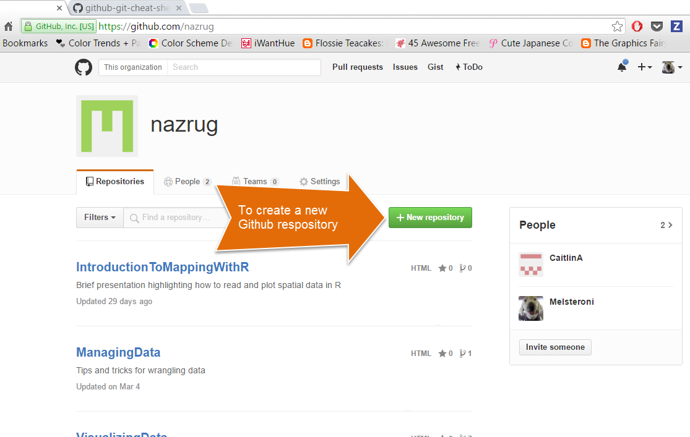
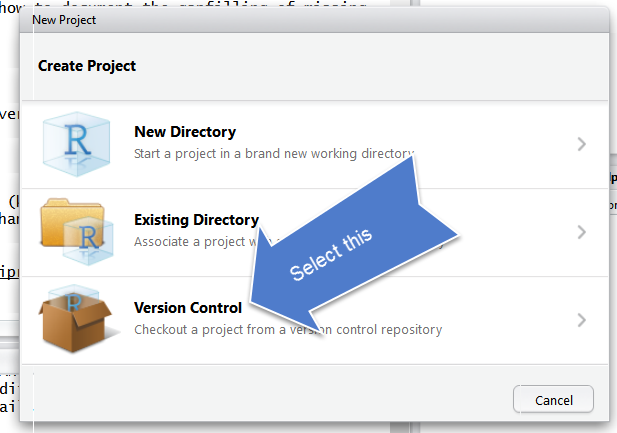
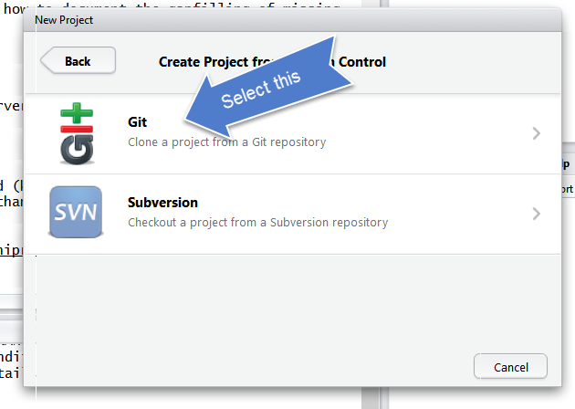
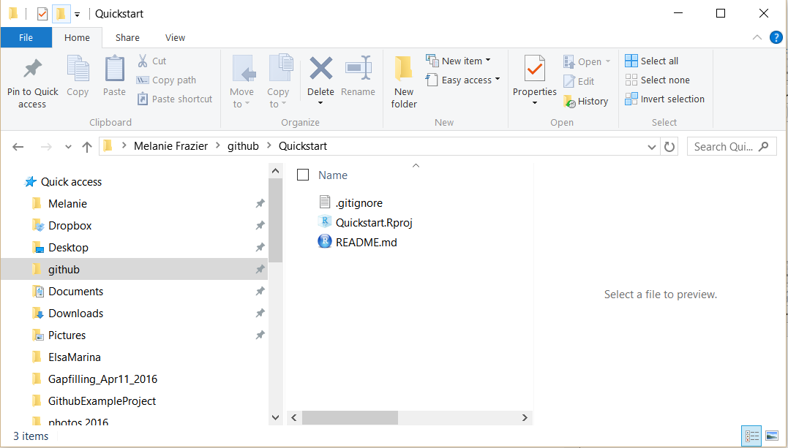

# GitHub {#github}

TODO: 
- no github folder, 
- new screenshots, 
- earlier emphasis on syncing steps. 
- no gh-pages branch! 
- fewer high level headers
- .Rprojects describe

<!---
### RStudio Projects

Create a new Project called 'r-for-excel-users'. File > New Project... > New Directory > New Project. Give your Project a name browse to a place to keep it. And then click to Create Project!

What is a Project? It is a way to organize all of the relevant things you need for an analysis in the same place. This means data, code, figures, notes, etc. 

Why does this matter? Keeping everything you need for your analysis together makes it less brittle and more portable — across people, time, and computers.  

Working directory = no file path/broken path issues. Notice that a folder now appears wherever you saved this project with the same name, and it contains a .Rproj file.

Now that we have our Project, here is an important question: where are we? Now we are in our Project. Everything we do will by default be saved here so we can be nice and organized. 

```{r, echo=FALSE, out.width="80%"}
knitr::include_graphics("img/RStudio_IDE_projdir.png")  
```

--->

```{r gh ops, include=FALSE}
knitr::opts_chunk$set(echo = TRUE)
library(htmltools)
```

## Summary 

We will learn about version control using git and GitHub, and we will interface with this through RStudio. Why use version control? To save time when working with your most important collaborator: you. 

## Objectives

Today, we'll interface with GitHub from our local computers using RStudio. There are many other ways to interact with GitHub, including GitHub's Desktop App or the command line ([here is Jenny Bryan's list of git clients](http://stat545.com/git02_git-clients.html)), but today we are going to work from RStudio. You have the largest suite of options if you interface through the command line, but the most common things you'll do can be done through one of these other applications (i.e. RStudio and the GitHub Desktop App).

Here's what we'll do after we set up git on your computers: 

1. create a repository on Github.com
1. clone locally using RStudio 
1. learn the RStudio-GitHub workflow by syncing to Github.com: pull, stage, commit, push
1. explore github.com: files, commit history, file history
1. practice the RStudio-GitHub workflow by editing and adding files 
1. practice R Markdown

git will track and version your files, GitHub stores this online and enables you to collaborate with others (and yourself). Although git and GitHub are two different things, distinct from each other, we can think of them as a bundle since we will always use them together. It also helped me to think of GitHub like Dropbox: you make folders that are 'tracked' and can be synced to the cloud. GitHub does this too, but you have to be more deliberate about when syncs are made. This is because GitHub saves these as different versions, with information about who contributed when, line-by-line. This makes collaboration easier, and it allows you to roll-back to different versions or contribute to others' work.


## Resources

These materials borrow from: 

- Jenny Bryan's lectures from STAT545 at UBC: [The Shell](http://stat545.com/git09_shell.html)
- Jenny Bryan's [Happy git with R](http://happygitwithr.com) tutorial
- Melanie Frazier's [GitHub Quickstart](https://rawgit.com/nazrug/Quickstart/master/GithubQuickstart.html), [GitHub Lesson at University of Queensland](https://github.com/OHI-Science/data-science-training/blob/master/github_mel.Rmd)
- Ben Best's [Software Carpentry at UCSB](http://remi-daigle.github.io/2016-04-15-UCSB/git/)

Today, we'll only introduce the features and terminology that new R users need to learn to begin managing their projects.


## Why should R users use Github?


1. Ends (or, nearly ends) the horror of keeping track of versions.
  Basically, we get away from this: 
<br />
<br />

<br />
<br />
When you open your repository, you only see the most recent version.  But, it easy to compare versions, and you can easily revert to previous versions. 
<br />
<br />
2. Improves collaborative efforts.  Different researchers can work on the same files at the same time!
3. It is easy to share and distribute files through the Github website.
4. Your files are available anywhere, you just need internet connection!  

### What are Git and Github?

- **Git** is a version control system that lets you track changes to files over time. These files can be any kind of file (eg .doc, .pdf, .xls), but free text differences are most easily visible (eg txt, csv, md). 

- **Github** is a website for storing your git versioned files remotely. It has many nice features to be able visualize differences between [images](https://help.github.com/articles/rendering-and-diffing-images/), [rendering](https://help.github.com/articles/mapping-geojson-files-on-github/) & [diffing](https://github.com/blog/1772-diffable-more-customizable-maps) map data files, [render text data files](https://help.github.com/articles/rendering-csv-and-tsv-data/), and [track changes in text](https://help.github.com/articles/rendering-differences-in-prose-documents/).

<!---
> If you are a student you can get the micro account which includes 5 private repositories for free (normally a $7/month value).  You can sign up for the student account [here](https://education.github.com/pack).  Instructors can also request a free organization [account, "Request a discount"](https://education.github.com/).
--->

Github was developed for social coding (i.e., sort of like an open source Wikipedia for programmers). Consequently, much of the functionality and terminology of Github (e.g., branches and pull requests) isn't necessary for a new R user getting started.  

These concepts are more important for coders who want the entire coding community (and not just people working on the same project) to be able to suggest changes to their code.  This isn't how most new R users will use Github.  

To get the full functionality of Github, you will eventually want to learn other concepts. But, this can wait.  

### Some Github terminology

* **User**: A Github account for you (e.g., jules32).
* **Organization**: The Github account for one or more user (e.g., datacarpentry).
* **Repository**: A folder within the organization that includes files dedicated to a project.
* **Local Github**: Copies of Github files located your computer.
* **Remote Github**: Github files located on the https://github.com website.
* **Clone**: Process of making a local copy of a remote Github repository.  This only needs to be done once (unless you mess up your local copy).
* **Pull**: Copy changes on the remote Github repository to your local Github repository.  This is useful if multiple people are making changes to a repository.
* **Push**: Save local changes to remote Github
<br />
<br />


<br />
<br />

<!---
## Setup Git & GitHub

We're going to switch gears from R for a moment and set up Git and GitHub, which we will be using along with R and RStudio for the rest of the workshop. This set up is a one-time thing! You will only have to do this once per computer. We'll walk through this together. 

1. We will use the `usethis` package to configure **git** with global commands, which means it will apply 'globally' to all files on your computer, rather than to a specific folder. 

```{r use this, eval=FALSE}

install.packages("usethis")
library(usethis)

use_git_config(user.name = "jules32", user.email = "jules32@example.org")

```

*BACKUP PLAN* If `usethis` fails, the following is the classic approach to configuring **git**.  Open the Git Bash program (Windows) or the Terminal (Mac) and type the following:

        # display your version of git
        git --version
        
        # replace USER with your Github user account
        git config --global user.name USER
        
        # replace NAME@EMAIL.EDU with the email you used to register with Github
        git config --global user.email NAME@EMAIL.EDU
        
        # list your config to confirm user.* variables set
        git config --list

Not only have you just set up git as a one-time-only thing, you have just used the command line. We don't have time to learn much of the command line today, but you just successfully used it following explicit instructions, which is huge! There are great resources for learning the command line, check out [this tutorial from SWC at UCSB](http://remi-daigle.github.io/2016-04-15-UCSB/shell/). 

### Troubleshooting

If you have problems setting up git, please see the [Troubleshooting section](http://happygitwithr.com/troubleshooting.html) in Jenny Bryan's amazing [HappyGitWithR](http://happygitwithr.com). 

#### New(ish) Error on a Mac
We've also seen the following errors from RStudio: 

```
error key does not contain a section --global terminal
```
and
```
fatal: not in a git directory
```

To solve this, go to the Terminal and type:
    ```
which git
```


  
Look at the filepath that is returned. Does it say anything to do with Apple?

-> If yes, then the [Git you downloaded](https://git-scm.com/downloads) isn't installed, please redownload if necessary, and follow instructions to install.  

-> If no, (in the example image, the filepath does not say anything with Apple) then proceed below:

In RStudio, navigate to: Tools > Global Options > Git/SVN. 


<br>

Does the **“Git executable”** filepath match what the url in Terminal says? 

<br>


If not, click the browse button and navigate there.   

>*Note*: on my laptop, even though I navigated to /usr/local/bin/git, it then automatically redirect because /usr/local/bin/git was an alias on my computer. That is fine. Click OK.

Quit RStudio.   

Then relaunch RStudio.  

Try syncing or cloning, and if that works and then you don’t need to worry about typing into the Terminal, you’re all done!
--->


## Create a repository on Github.com

First, go to your account on github.com and click "New repository".
<br />
<br />

<br />
<br />

Choose a name. Call it whatever you want (the shorter the better), or follow me for convenience. I will call mine `r-workshop`. 

Also, add a description, make it public, create a README file, and create your repo!
<br />
<br />

<br />
<br />

The *Add gitignore* option adds a document where you can identify files or file-types you want Github to ignore. These files will stay in on the local Github folder (the one on your computer), but will not be uploaded onto the web version of Github.

The *Add a license* option adds a license that describes how other people can use your Github files (e.g., open source, but no one can profit from them, etc.).  We won't worry about this today.

Check out our new repository!  

Notice how the README.md file we created is automatically displayed at the bottom. The .md means that it is Markdown (remember how .Rmd was RMarkdown?) so the formatting we learned in the last lesson apply here.
<br />
<br />


<br />
<br />

## Create a gh-pages branch

We aren't going to talk about branches very much, but they are a powerful feature of git/GitHub. I think of it as creating a copy of your work that becomes a parallel universe that you can modify safely because it's not affecting your original work. And then you can choose to merge the universes back together if and when you want. By default, when you create a new repo you begin with one branch, and it is named `master`. When you create new branches, you can name them whatever you want. However, if you name one `gh-pages` (all lowercase, with a `-` and no spaces), this will let you create a website. And that's our plan. So, let's do this to create a `gh-pages` branch: 

On the homepage for your repo on GitHub.com, click the button that says "Branch:master". Here, you can switch to another branch (right now there aren't any others besides `master`), or create one by typing a new name. 


<br>

Let's type `gh-pages`. 

<br>

 

Let's also change `gh-pages` to the default branch and delete the master branch: this will be a one-time-only thing that we do here: 

First click to control branches:

 

And then click to change the default branch to `gh-pages`. I like to then delete the `master` branch when it has the little red trash can next to it. It will make you confirm that you really want to delete it, which I do!

 


**From here, you will work locally (on your computer).**


## Clone your repository using RStudio

We'll start of by cloning to our local computer using RStudio. We are going to be cloning a copy of our Remote repository on Github.com to our local computers. Unlike downloading, cloning keeps all the version control and user information bundled with the files. 

**Step 0**: Create your `github` folder 

This is really important! We need to be organized and deliberate about where we want to keep all of our GitHub repositories (since this is the first of many in your career). 

Let's all make a folder called `github` (all lowercase!) in our home directories. So it will look like this: 

- Windows: `Users\[User]\Documents\github\`
- Mac: `Users/[User]/github/`

This will let us take advantage of something that is really key about GitHub.com: you can easily navigate through folders within repositories and the urls reflect this navigation. The greatness of this will be evident soon. So let's set ourselves up for easily translating (and remembering) those navigation paths by having a folder called `github` that will serve as our 'github.com'.

So really. Make sure that you have an all-lowercase folder called `github` in your home directory!!

**Step 1**: Copy the web address of the repository you want to clone.
<br />


<br />
<br />

**Step 2**: from RStudio, go to New Project (also in the File menu).


<br />
<br />

**Step 3**: Select Version Control

<br />
<br />


<br />
<br />

**Step 4**: Select Git

<br />
<br />


<br />
<br />

**Step 5**: Paste it in the Repository URL field, and type **tab** to autofill the Project Directory name. Make sure you keep the Project Directory Name **THE SAME** as the repository name from the URL.

Save it in your github folder (click on Browse) to do this. 

<br />
<br />


<br />
<br />

If everything went well, the repository will be added to the list located here:


<br />
<br />

And the repository will be saved to the Github folder on your computer:
<br />
<br />


<br />
<br />

Ta da!!!!  The folder doesn't contain much of interest, but we are going to change that.

## Inspect your repository

Notice a few things in our repo here: 

1. Our working directory is set to `~/github/r-workshop`. This means that I can start working with the files I have in here without setting the filepath. This is that when we cloned this from RStudio, it created an RStudio project, which you can tell because: 
    - `.RProj` file, which you can see in the Files pane. 
    - The project is named in the top right hand corner
1. We have a git tab! This is how we will interface directly to Github.com


<br>

When you first clone a repo through RStudio, RStudio will add an `.Rproj` file to your repo. And if you didn't add a `.gitignore` file when you originally created the repo on GitHub.com, RStudio will also add this for you. These will show up with little yellow `?` icons in your git tab. This is GitHub's way of saying: "I am responsible for tracking everything that happens in this repo, but I haven't seen these files yet. Do you want me to track them too?" (We'll see that when you click the box to stage them, they will turn into `A`s because they have been added to the repo. 


## Project oriented workflows

- [](https://rstats.wtf/project-oriented-workflow.html)

The repository will contain:

* .gitignore file
* README.md
* Rproj

## Add files to our local repo

Let's create the following:

* folder called "data"
* folder called "figures"  

They both show up in your Finder! ...

### Get data files into your working directory

In Session 1, we introduced how and why R Projects are great for reproducibility, because our self-contained working directory will be the **first** place R looks for files. 

You downloaded several files for this workshop, some comma separate value (CSV) files and some as Excel spreadsheets (.xlsx): 

- fish_counts_curated.csv
- invert_counts_curated.xlsx
- kelp_counts_curated.xlsx
- substrate_cover_curated.xlsx
- lobsters.xlsx
- lobsters2.xlsx
- ca_np.csv 
- ci_np.xlsx

Copy and paste those files into the 'data' subfolder of your R project. Notice that now these files are in your working directory when you go back to that Project in RStudio (check the 'Files' tab and navigate to the data subfolder). That means they're going to be in the first place R will look when you ask it to find a file to read in. 

<!---
To be organized, let's also create the following: 

* folders for "data" and "figures"  

We can do this in a few ways: 

- click the green plus "New Folder" icon at the top of the files pane and create a folder called "data"
- go to your Finder/Windows explorer 
--->

I'm going to go to the Finder (Windows Explorer on a PC) and copy a file into my repository from there. And then I'm going to go back to RStudio -- it shows up in the git tab! So the repository is being tracked, no matter how you make changes to it (changes do not have to be done only through RStudio). 

To make changes to the repository, you will work from your computer ("local Github").

When files are changed in the local repository, these changes will be reflected in the Git tab of RStudio:
<br />
<br />


<br />
<br />

### Inspect what has changed

These are the codes RStudio uses to describe how the files are changed, (from the RStudio [cheatsheet](http://www.rstudio.com/wp-content/uploads/2016/01/rstudio-IDE-cheatsheet.pdf)):


## Sync from RStudio to GitHub

When you are ready to commit your changes, you follow these steps:
<br />
<br />


<br />
<br />

We walk through this process below:

### Pull 
From the Git tab, "Pull" the repository.  This makes sure your local repository is synced with the remote repository.  This is very important if other people are making changes to the repository or if you are working from multiple computers.
<br />
<br />


<br />
<br />

### Stage
Stage the files you want to commit.  In RStudio, this involves checking the "Staged" boxes:
<br />


<br />
<br />

### Commit
<br />


<br />
<br />

### Push
<br />


<br />

## Explore remote Github
The files you added should be on github.com:
<br />


<br />
<br />

Let's also explore commit history, file history.

### Activity

Go back to RStudio. 

This time let's edit an existing file instead of adding something new. Open your README file by clicking on it in the Files pane (lower right corner). Write a few lines of text (like your dog's name), save, and see what happens in your Git Tab. Sync it to your remote repository at Github.com. 

## Create a new R Markdown file

Now get ourselves back into learning R. We are going to use R Markdown so that you can write notes to yourself in Markdown, and have a record of all your R code. Writing R commands in the console like we did this morning is great, but limited; it's hard to keep track of and hard to efficiently share with others. Plus, as your analyses get more complicated, you need to be able to see them all in one place.

Go to File > New File > R Markdown ... (or click the green plus in the top left corner).

Let's set up this file so we can use it for the rest of the day. I'm going to delete all the text that is already there and write some new text.

This will be your notes for the next session.

Here's what I'm going to write in my R Markdown file to begin: 


```
---
title: "Reading data into R with `readxl`"
author: "Julie Lowndes"
date: "12/7/2019"
output: html_document
---

# Learning `readxl`

We are working with data and it's going to be amazing.

```

Now, let's save it. I'm going to call my file `readxl.Rmd`. You can knit it if you'd like. 

Then, knit your file, and sync your file to GitHub: commit and pull

What if a file doesn't show up in the Git tab and you expect that it should? Check to make sure you've saved the file. If the filename is red with an asterix, there have been changes since it was saved. Remember to save before syncing to GitHub!

## Explore your webpage

You've just created a webpage! 

It will exist at this url: username.github.io/repo-name/filename. Mine is: jules32.github.io/r-workshop/readxl. 

> ***ProTip*** Pay attention to URLs. An unsung skill of the modern analyst is to be able to navigate the internet by keeping an eye on patterns.

Troubleshooting:

- 404 error? Remove trailing / from the url 
- Wants you to download? Remove trailing .Rmd from the url


## Committing - how often? Tracking changes in your files

Whenever you make changes to the files in Github, you will walk through the Pull -> Stage -> Commit -> Push steps.

I tend to do this every time I finish a task (basically when I start getting nervous that I will lose my work).  Once something is committed, it is very difficult to lose it.

One thing that I love about about Github is that it is easy to see how files have changed over time.  Usually I compare commits through github.com:
<br />
<br />


<br />
<br />
<br />
<br />


<br />
<br />

You can click on the commits to see how the files changed from the previous commit:
<br />
<br />


<br />
<br />


## Happy Git with R

If you have problems, we'll help you out using Jenny Bryan's [HappyGitWithR](http://happygitwithr.com), particularly the sections on [Detect Git from RStudio](http://happygitwithr.com/rstudio-see-git.html) and [RStudio, Git, GitHub Hell (troubleshooting)](http://happygitwithr.com/troubleshooting.html). So as we are coming around, have a look at it and see if you can help troubleshoot too!


### END **GitHub** session!

