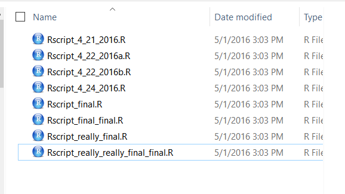
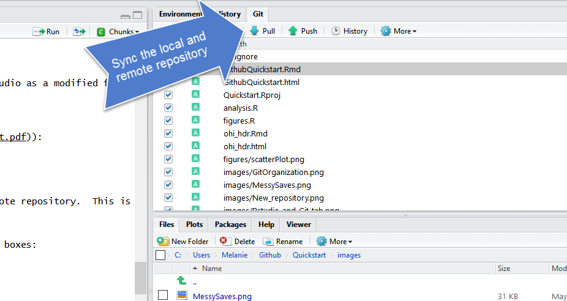
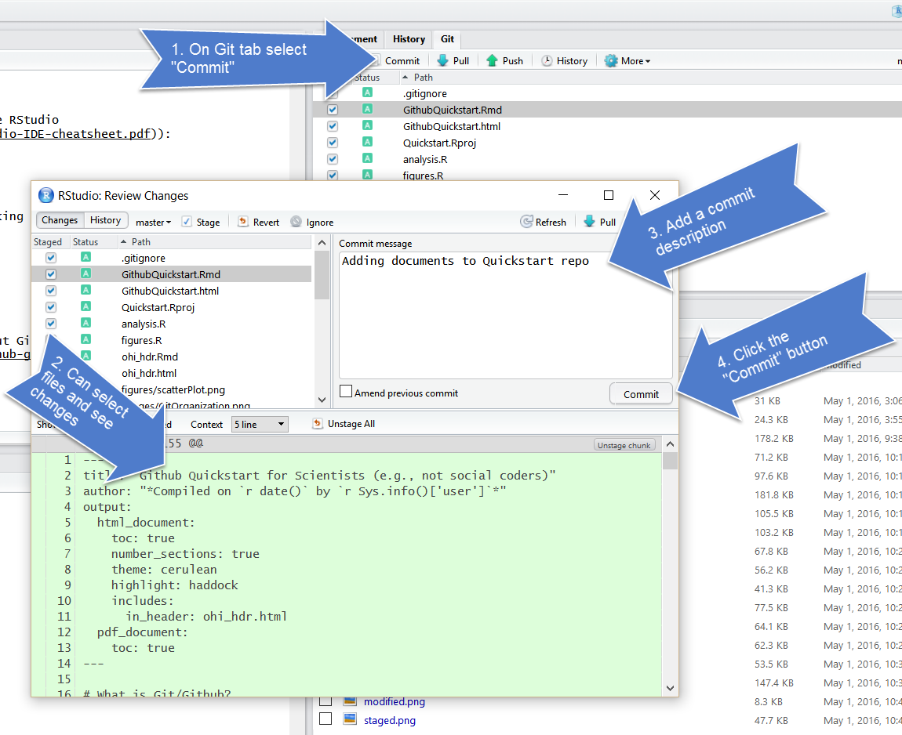

# GitHub {#github}

TODO: 
- new screenshots, 


```{r gh ops, include=FALSE}
knitr::opts_chunk$set(echo = TRUE)
library(htmltools)
```

## Summary 

We will learn about version control using git and GitHub, and we will interface with this through RStudio. Why use version control? To save time when working with your most important collaborator: you. 

## Objectives

Today, we'll interface with GitHub from our local computers using RStudio. There are many other ways to interact with GitHub, including GitHub's Desktop App or the command line ([here is Jenny Bryan's list of git clients](http://stat545.com/git02_git-clients.html)), but today we are going to work from RStudio. You have the largest suite of options if you interface through the command line, but the most common things you'll do can be done through one of these other applications (i.e. RStudio).

Here's what we'll do, since we've already set up git on your computers in the previous session ([Setup Git & GitHub](#rstudio/#setup-git-github): 

1. create a repository on Github.com
1. clone locally using RStudio 
1. syncing to GitHub.com: pull, stage, commit, push
1. explore github.com files, commit history, README
1. project-oriented workflows
1. project-oriented workflows in action

git will track and version your files, GitHub stores this online and enables you to collaborate with others (and yourself). Although git and GitHub are two different things, distinct from each other, we can think of them as a bundle since we will always use them together. 

It also helped me to think of GitHub like Dropbox: you make folders that are 'tracked' and can be synced to the cloud. GitHub does this too, but you have to be more deliberate about when syncs are made. This is because GitHub saves these as different versions, with information about who contributed when, line-by-line. This makes collaboration easier, and it allows you to roll-back to different versions or contribute to others' work.


## Resources

These materials borrow from: 

- [Happy git with R](http://happygitwithr.com) by Jenny Bryan
- [What They Forgot to Teach You About R: project-oriented workflows](https://rstats.wtf/project-oriented-workflow.html) by Jenny Bryan
- [GitHub Quickstart](https://rawgit.com/nazrug/Quickstart/master/GithubQuickstart.html) by Melanie Frazier 

Today, we'll only introduce the features and terminology that new R users need to learn to begin managing their projects.


## Why should R users use Github?

TODO: refine

1. Ends (or, nearly ends) the horror of keeping track of versions.
  Basically, we get away from this: 
<br />
<br />

<br />
<br />
When you open your repository, you only see the most recent version.  But, it easy to compare versions, and you can easily revert to previous versions. 
<br />
<br />
2. Improves collaborative efforts.  Different researchers can work on the same files at the same time!
3. It is easy to share and distribute files through the Github website.
4. Your files are available anywhere, you just need internet connection!  

### What are Git and Github?

- **Git** is a version control system that lets you track changes to files over time. These files can be any kind of file (eg .doc, .pdf, .xls), but free text differences are most easily visible (eg txt, csv, md). 

- **Github** is a website for storing your git versioned files remotely. It has many nice features to be able visualize differences between [images](https://help.github.com/articles/rendering-and-diffing-images/), [rendering](https://help.github.com/articles/mapping-geojson-files-on-github/) & [diffing](https://github.com/blog/1772-diffable-more-customizable-maps) map data files, [render text data files](https://help.github.com/articles/rendering-csv-and-tsv-data/), and [track changes in text](https://help.github.com/articles/rendering-differences-in-prose-documents/).

<!---
> If you are a student you can get the micro account which includes 5 private repositories for free (normally a $7/month value).  You can sign up for the student account [here](https://education.github.com/pack).  Instructors can also request a free organization [account, "Request a discount"](https://education.github.com/).
--->

Github was developed for social coding (i.e., sort of like an open source Wikipedia for programmers). Consequently, much of the functionality and terminology of Github (e.g., branches and pull requests) isn't necessary for a new R user getting started.  

These concepts are more important for coders who want the entire coding community (and not just people working on the same project) to be able to suggest changes to their code.  This isn't how most new R users will use Github.  

To get the full functionality of Github, you will eventually want to learn other concepts. But, this can wait.  

### Some Github terminology

* **User**: A Github account for you (e.g., jules32).
* **Organization**: The Github account for one or more user (e.g., datacarpentry).
* **Repository**: A folder within the organization that includes files dedicated to a project.
* **Local Github**: Copies of Github files located your computer.
* **Remote Github**: Github files located on the https://github.com website.
* **Clone**: Process of making a local copy of a remote Github repository.  This only needs to be done once (unless you mess up your local copy).
* **Pull**: Copy changes on the remote Github repository to your local Github repository.  This is useful if multiple people are making changes to a repository.
* **Push**: Save local changes to remote Github
<br />
<br />


<br />
<br />


## Create a repository on Github.com

First, go to your account on github.com. Notice that the URL is github.com/your-username.

Click "New repository".

<br>

```{r, echo=FALSE, out.width="80%"}
knitr::include_graphics("img/gh_repo_create.png")  
```

<br>

Choose a name. Call it whatever you want (the shorter the better), or follow me for convenience. I will call mine `r-workshop`. 

Also, add a description, make it public, create a README file, and create your repo!

<br>

```{r, echo=FALSE, out.width="80%"}
knitr::include_graphics("img/gh_repo_create.png")  
```

<br>

The *Add gitignore* option adds a document where you can identify files or file-types you want Github to ignore. These files will stay in on the local Github folder (the one on your computer), but will not be uploaded onto the web version of Github.

The *Add a license* option adds a license that describes how other people can use your Github files (e.g., open source, but no one can profit from them, etc.).  We won't worry about this today.

Check out our new repository!  


<br>

```{r, echo=FALSE, out.width="80%"}
knitr::include_graphics("img/gh_repo_new.png")  
```

<br>

Great! So now we have our new repository that exists in the Cloud. Let's get it established locally on our computers: that is called "cloning". 

## Clone your repository using RStudio

Let's clone this repo to our local computer using RStudio. Unlike downloading, cloning keeps all the version control and user information bundled with the files. 

<!---
**Step 0**: Create your `github` folder 

This is really important! We need to be organized and deliberate about where we want to keep all of our GitHub repositories (since this is the first of many in your career). 

Let's all make a folder called `github` (all lowercase!) in our home directories. So it will look like this: 

- Windows: `Users\[User]\Documents\github\`
- Mac: `Users/[User]/github/`

This will let us take advantage of something that is really key about GitHub.com: you can easily navigate through folders within repositories and the urls reflect this navigation. The greatness of this will be evident soon. So let's set ourselves up for easily translating (and remembering) those navigation paths by having a folder called `github` that will serve as our 'github.com'.

So really. Make sure that you have an all-lowercase folder called `github` in your home directory!!

--->

### Copy the repo address 

First, copy the web address of the repository you want to clone. (By default this is HTTPS, but you could alternatively set up with SSH. This is more advanced than we will get into here, but allows 2-factor authentication. See [Happy Git with R](https://happygitwithr.com/credential-caching.html#special-consideration-re-two-factor-authentication) for more information.)

<br>

```{r, echo=FALSE, out.width="80%"}
knitr::include_graphics("img/gh_repo_clone1.png")  
```

<br>

### RStudio: New Project

Now go back to RStudio, and click on New Project. There are a few different ways; you could also go to File > New Project..., or click the little green + with the R box in the top left.
also in the File menu).

<br>

```{r, echo=FALSE, out.width="80%"}
knitr::include_graphics("img/new_project1.png")  
```

<br>


### Select Version Control

<br>

```{r, echo=FALSE, out.width="80%"}
knitr::include_graphics("img/new_project2.png")  
```

<br>

### Select Git

Since we are using git. 

<br>

```{r, echo=FALSE, out.width="80%"}
knitr::include_graphics("img/new_project3.png")  
```

<br>


### Paste the repo address

Paste the repo address (which is still in your clipboard) into in the "Repository URL" field. The "Project directory name" should autofill; if it does not press *tab*, or type it in. It is best practice to keep the "Project directory name" **THE SAME** as the repository name.

When cloned, this repository is going to become a folder on your computer. 

At this point you can save this repo anywhere. There are different schools of thought but we think it is useful to create a high-level folder where you will keep your github repos to keep them organized. We call ours `github` and keep it in our root folder (`~/github`), and so that is what we will demonstrate here — you are welcome to do the same. Press "Browse..." to navigate to a folder and you have the option of creating a new folder. 

Save it in your github folder (click on Browse) to do this. 

<br>

```{r, echo=FALSE, out.width="80%"}
knitr::include_graphics("img/new_project4.png")  
```

<br>


### Admire your local repo

If everything went well, the repository will be added to the list located here:

<br>

```{r, echo=FALSE, out.width="80%"}
knitr::include_graphics("img/new_project5.png")  
```

<br>

The repository is also saved to the location you specified, and you can navigate to it as you normally would in Finder or Windows Explorer: 

<br>

```{r, echo=FALSE, out.width="80%"}
knitr::include_graphics("img/new_project6.png")  
```

<br>

Hooray!

### Inspect your local repo

TODO: rework. 

Let's notice a few things: 

First, our working directory is set to `~/github/r-workshop`, and `r-workshop` is also named in the top right hand corner.

Second, we have a Git tab in the top right pane! Let's click on it. 

<br>

```{r, echo=FALSE, out.width="80%"}
knitr::include_graphics("img/new_project5_annotated.png")  
```

<br>

Our Git tab has 2 items:

- .gitignore file
- .Rproj file

These have been added to our repo by RStudio — we can also see them in the File pane in the bottom right of RStudio. These are helper files that RStudio has added to streamline our workflow with GitHub and R. We will talk about the .Rproj file soon, and we won't talk about the .gitignore file today. <!---TODO but it's for --->. One thing to note about these files is that they begin with a period (`.`) which means they are hidden files: they show up in the Files pane of RStudio but won't show up in your Finder.

Going back to the Git tab, both these files have little yellow icons with question marks `?`. This is GitHub's way of saying: "I am responsible for tracking everything that happens in this repo, but I'm not sure what is going on with these files yet. Do you want me to track them too?" 
Let's click the boxes next to each file. This is called staging a file: you are indicating that you want GitHub to track this file. You'll see that the question marks turn into an A because these are new files that have been added to your repo (automatically by RStudio, not by you). 

These are the codes RStudio uses to describe how the files are changed, (from the RStudio [cheatsheet](http://www.rstudio.com/wp-content/uploads/2016/01/rstudio-IDE-cheatsheet.pdf)):

<br>

```{r, echo=FALSE, out.width="80%"}
knitr::include_graphics("img/commit_codes_added_modified.png")  
```

<br>


### Edit your README file

Let's also open up the README.md. We will edit the file and illustrate how GitHub tracks files that have been modified (to complement seeing how it tracks files that have been added. 

README files are common in programming; they are the first place that someone will look to see why code exists and how to run it. 

In my README, I'll write: 

```
This repo is for my analysis at RStudio::conf(2020). 
```

When I save this, notice how it shows up in my Git tab. It has a blue "M": GitHub is already tracking this file, and tracking it line-by-line, so it knows that something is different. 

Great. Let's walk through all the steps of Syncing back to GitHub. 


## Sync from RStudio (local) to GitHub (remote)

Syncing to GitHub.com means 4 steps: 

1. Pull
1. Stage
1. Commit
1. Push

<br>

```{r, echo=FALSE, out.width="80%"}
knitr::include_graphics("img/commit_steps.png")  
```

<br>

We start off this whole process by clicking on the Commit section. 

TODO: image circling Commit 

### Pull 

We start off by "Pulling" from the remote repository (GitHub.com) to make sure that our local copy has the most up-to-date information that is available online. Right now, since we just created the repo and are the only ones that have permission to work on it, we can be pretty confident that there isn't new information availble. But we pull anyways because this is a very safe habit to get into for when you start collaborating with yourself across computers or others. Best practice is to pull often: it costs nothing (other than an internet connection). 

Pull by clicking the teal Down Arrow. 

TODO: redo figs
<br />
<br />


<br />
<br />

### Stage

Stage the files you want to commit.  We've already done this with our .Rproj and .gitignore files, but let's stage the README.md as well. 

Check the "Staged" boxes:

<br />


<br />
<br />

### Commit

TODO: text

<br />


<br />
<br />

### Push

TODO: text

<br />


<br />

## Commit history

TODO: more, swap out images

The files you added should be on github.com:
<br />


<br />
<br />

Let's also explore commit history, file history.

## README

TODO: why it's important, GitHub

Notice how the README.md file we created is automatically displayed at the bottom. The .md means that it is Markdown (remember how .Rmd was RMarkdown?) so the formatting we learned in the last lesson apply here.

## Project-oriented workflows

This GitHub repository is now also an RStudio Project. This just means that RStudio has saved this additional file with extension `.Rproj` (ours is `r-workshop.Rproj`) to store specific settings for this project. It's a bit of technology to help us get into the good habit of having a project-oriented workflow. 

A [project-oriented workflow](https://rstats.wtf/project-oriented-workflow.html) means that we are going to organize all of the relevant things we need for our analyses in the same place. That means that this is the place where we keep all of our data, code, figures, notes, etc. 

Why does this matter? It's convenient for us to have everything associated with our analyses close at-hand.  When we work with different files in R (like data or saved graphs) we always need to tell R where things "live" by identifying its file path. If files are scattered across your computer, we would have to keep track of many different filepaths. So using RStudio Projects and having a project-oriented workflow and mindset makes our analysis less brittle and more portable — across people, time, and computers.  

### Project directory

Now that we have our Project, here is an important question: where are we? Now we are in our Project. Everything we do will by default be saved here so we can be nice and organized. 

And this is important because if Allison clones this repository that you just made and saves it in `Allison/my/projects/way/over/here`, she will still be able to interact with your files as you are here.

```{r, echo=FALSE, out.width="80%"}
knitr::include_graphics("img/RStudio_IDE_projdir.png")  
```

## Project-oriented workflows in action (aka setup)

TODO: 

Let's get a bit organized. First, let's create our a new R Markdown file where we will do our analyses. This will be nice because you can also write notes to yourself in this document. 

### Create a new Rmd file

So let's do this: 

File > New File > R Markdown ... (or click the green plus in the top left corner).

Let's set up this file so we can use it for the rest of the day. I'm going to update the header with a new title and add my name, and then I'm going to delete the rest of the document so that we have a clean start. 

> **Efficiency Tip**: I use Shift - Command - Down Arrow to highlight text from my cursor to the end of the document

```
---
title: "Creating charts in R with `ggplot2`"
author: "Julie Lowndes"
date: "01/27/2020"
output: html_document
---

# Plots with ggplot2

We are going to make plots in R and it's going to be amazing.

```

Now, let's save it. I'm going to call my file `plots-ggplot.Rmd`. 

Notice that when we save this file, it pops up in our Git tab. Git knows that there is something new in our repo. 

Let's also knit this file. And look: Git also sees the knitted .html. 


And let's practice syncing our file to to GitHub: commit and pull

What if a file doesn't show up in the Git tab and you expect that it should? Check to make sure you've saved the file. If the filename is red with an asterix, there have been changes since it was saved. Remember to save before syncing to GitHub!


Let's create the following:

* folder called "data"
* folder called "figures"  

They both show up in your Finder! ...

### Get data files into your working directory

In Session 1, we introduced how and why R Projects are great for reproducibility, because our self-contained working directory will be the **first** place R looks for files. 

You downloaded several files for this workshop, some comma separate value (CSV) files and some as Excel spreadsheets (.xlsx): 

- fish_counts_curated.csv
- invert_counts_curated.xlsx
- kelp_counts_curated.xlsx
- substrate_cover_curated.xlsx
- lobsters.xlsx
- lobsters2.xlsx
- ca_np.csv 
- ci_np.xlsx

Copy and paste those files into the 'data' subfolder of your R project. Notice that now these files are in your working directory when you go back to that Project in RStudio (check the 'Files' tab and navigate to the data subfolder). That means they're going to be in the first place R will look when you ask it to find a file to read in. 

<!---
To be organized, let's also create the following: 

* folders for "data" and "figures"  

We can do this in a few ways: 

- click the green plus "New Folder" icon at the top of the files pane and create a folder called "data"
- go to your Finder/Windows explorer 
--->

I'm going to go to the Finder (Windows Explorer on a PC) and copy a file into my repository from there. And then I'm going to go back to RStudio -- it shows up in the git tab! So the repository is being tracked, no matter how you make changes to it (changes do not have to be done only through RStudio). 

To make changes to the repository, you will work from your computer ("local Github").

When files are changed in the local repository, these changes will be reflected in the Git tab of RStudio:
<br />
<br />


<br />
<br />


### Edit your README again

Let's also open up the README and write a bit of information. READMEs


### Activity

Go back to RStudio. 

This time let's edit an existing file instead of adding something new. Open your README file by clicking on it in the Files pane (lower right corner). Write a few lines of text (like your dog's name), save, and see what happens in your Git Tab. Sync it to your remote repository at Github.com. 

## Committing - how often? Tracking changes in your files

Whenever you make changes to the files in Github, you will walk through the Pull -> Stage -> Commit -> Push steps.

I tend to do this every time I finish a task (basically when I start getting nervous that I will lose my work).  Once something is committed, it is very difficult to lose it.

One thing that I love about about Github is that it is easy to see how files have changed over time.  Usually I compare commits through github.com:
<br />
<br />


<br />
<br />
<br />
<br />


<br />
<br />

You can click on the commits to see how the files changed from the previous commit:
<br />
<br />


<br />
<br />


## Happy Git with R

If you have problems, we'll help you out using Jenny Bryan's [HappyGitWithR](http://happygitwithr.com), particularly the sections on [Detect Git from RStudio](http://happygitwithr.com/rstudio-see-git.html) and [RStudio, Git, GitHub Hell (troubleshooting)](http://happygitwithr.com/troubleshooting.html). So as we are coming around, have a look at it and see if you can help troubleshoot too!


### END **GitHub** session!

