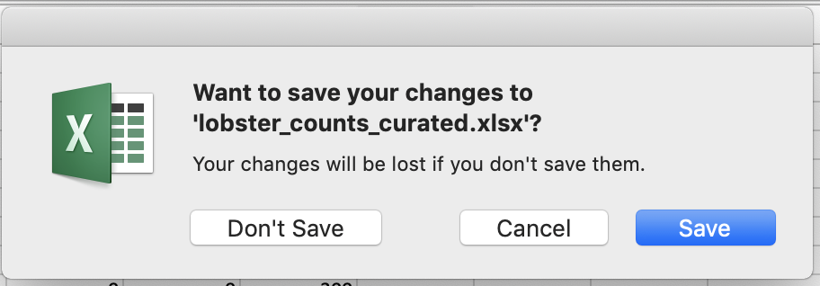

# Overview {#overview}

TODO: add Star Wars illustrations & Wickham R4DS illustration (as slides? potentially adapt [UQ slides](https://docs.google.com/presentation/d/17TBDqEBTErKsUHezXVHBGM8Qhd50wnS3lnBqhzCtl_4/edit#slide=id.g5bfcc15cf3_0_28))


<!---

[Allison Lecture 2](https://docs.google.com/presentation/d/1u1DdhU_WTv1b-sbQgqVGAE-bA2Nq_Yym8BzcPW4lS3k/edit#slide=id.g64562b5505_0_41)
There are often many solutions that work - try to focus on and use solutions that work and are clear, well-organized, and that use consistent/familiar syntax

CUT this bc will become apparent/intro through github.
A few areas for potential improvement: 

No clear or organized history of what’s been done to the data from raw data through final figures
Lack of comments/annotation describing the steps
Tedious & time consuming for a collaborator to recreate the analyses
Backed up w/version control? Probably not…
How do we transfer this into a final report or presentation? Is that reproducible?


--->

## Welcome! 

In this workshop you will learn hands-on how to begin to interoperate between Excel and R. But this workshop is not only about learning R; we will learn R using additional software: RStudio and GitHub. These tools will help us develop good habits for working in a reproducible and collaborative way — critical attributes of the modern analyst. 

It's going to be fun and empowering! 

## Why learn R if I know Excel? 

Excel is a widely used and powerful tool for working with data, and it is great for a lot of things. This is convenient and familiar; most of us have had their first experiences with data through Excel or other spreadsheet programs. As Jenny Bryan has said, ["Excel is how we learn that we love data analysis"](). 

Excel is great for data entry. Can also be good for looking at data and feeling like you can touch it, and creating quick exploratory figures.  

Excel can also become problematic with extending to analyses. This is because there aren't firm lines between what is data and what is analyses. For example, in this sheet:

```{r, echo=FALSE, out.width="70%"}
knitr::include_graphics("img/excel-sheet-example.png")  
#https://www.smartsheet.com/how-to-make-spreadsheets
```

<br>

This makes the analytical steps taken are not readily apparent, nor easy to reproduce.  Have you ever done forensics on an Excel sheet, trying to understand what happened between columns or sheets? Maybe it was even your own Excel file from the (recent) past. 


<!--- And there are also problems with Excel incorrectly interpreting data as dates, etc. Horror Stories! Economist etc. -- 

Mine: genetics example doesn't hit home as much as Durham bike  accidents where age groups are converted to dates just by opening the bloody csv in excel--->

This also makes them pretty brittle/sensitive to minor changes. Has seeing this ever given you a feeling of horror: 

```{r, echo=FALSE, out.width="80%"}
  
```

<br>

So while it is great how easily you can update different fields and add analytical steps in an Excel sheet, it can also be a bit hard to handle, particularly as projects get more complicated. 

So, as automation, reproducibility, collaboration, and frequent reporting become increasingly expected in data analysis, a good option for Excel users is to extend their workflows with R. 

<!---Integrating R into data analysis with Excel can bridge the technical gap between collaborators using either software. R enables use of existing tools built for specific tasks and overcomes some limitations that arise when working with large datasets or repeated analyses. --->

<!---
Excel blends data and analysis into the same place. But as we use R we will talk about keeping data separate from analyses: "Keeping the raw data raw."
--->

### What to expect

This is going to be a fun workshop. 

This workshop will give you hands-on experience and confidence with R, and how to interoperate between Excel and R — it is not about wholesale replacing everything you do in Excel into R. 
We will learn technical skills that you can incrementally incorporate into your existing workflows. But a big part of interfacing between Excel and R is not only skillsets, it is mindsets. It is the mindset about how we think about data. How we shape data and organize data and analyze data. And how what we do now can make our analytical life better in the future.

**A modern R user has a workflow framed around collaboration**, and uses an ecosystem of tools and practices. We will be learning three main things all at the same time: 

1. coding with best practices (R/RStudio/tidyverse)
2. collaborative bookkeeping (Git/GitHub)
3. reporting and publishing (RMarkdown/GitHub) 

**R users keep raw data separate from their analyses**, which means having data in one file and written computational commands saved as a separate file. We also embrace the concept of **"tidy data"**, where the data has a rectangular shape and each column is a variable and each row is an observation. Tidy data is a way of life.

```{r, echo=FALSE, out.width="70%"}
knitr::include_graphics("img/tidy_img_np.png")  
```

<br>

<!---
**We will teach R/RStudio/GitHub/tidyverse/RMarkdown all together** to reinforce skills and best practices, and get you comfortable with a workflow that you can have confidence using in your own work, and interface with Excel in your own analyses and with collaborators. You'll be working hands-on and doing the same things on your own computer as we do live on up on the screen. 


We will use R to produce analyses people can understand and build from — including Future You and Future Us. The plan is to expose you to tools and workflows that you can have confidence using in your work.

--->

**We are going to go through a lot in these two days** and it's less important that you remember it all. More importantly, you'll have experience with it and confidence that you can do it. The main thing to take away is that there *are* good ways to work between R and Excel; we will teach you to expect that so you can find what you need and use it! A theme throughout is that tools exist and are being developed by real, and extraordinarily nice, people to meet you where you are and help you do what you need to do.

**You are all welcome here**, please be respectful of one another. Everyone in this workshop is coming from a different place with different experiences and expectations. But everyone will learn something new here, because there is so much innovation in the data science world. Instructors and helpers learn something new every time, from each other and from your questions. If you are already familiar with some of this material, focus on how we teach, and how you might teach it to others. Use these workshop materials not only as a reference in the future but also for talking points so you can communicate the importance of these tools to your communities. A big part of this training is not only for you to learn these skills, but for you to also teach others and increase the value and practice of open data science in science as a whole. 

<!---
## Friendly mindset

"pain of failure, it’s just the pain of learning." - [Gordon Shotwell](https://blog.shotwell.ca/posts/r_for_excel_users/)

Something else to start us off is to mention that you are learning a new language here. It's an ongoing process, it takes time, you'll make mistakes, it can be frustrating, but it will be overwhelmingly awesome in the long run. We all speak at least one language; it's a similar process, really. And no matter how fluent you are, you'll always be learning, you'll be trying things in new contexts, learning words that mean the same as others, etc, just like everybody else. And just like any form of communication, there will be miscommunications that can be frustrating, but hands down we are all better off because of it. 

While language is a familiar concept, programming languages are in a different context from spoken languages, but you will get to know this context with time. For example: you have a concept that there is a first meal of the day, and there is a name for that: in English it's "breakfast". So if you're learning Spanish, you could expect there is a word for this concept of a first meal. (And you'd be right: 'desayuno'). **We will get you to expect that programming languages also have words (called functions in R) for concepts as well**. You'll soon expect that there is a way to order values numerically. Or alphabetically. Or search for patterns in text. Or calculate the median. Or reorganize columns to rows. Or subset exactly what you want. We will get you increase your expectations and learn to ask and find what you're looking for.

You came here to learn R, but we are going to learn R together with RStudio. 

--->

## Guiding principles / recurring themes

**"Keep the raw data raw"** — A hard line separating raw data and analyses. In R, we have data in one file and written computational commands saved as a separate file.

**Scripted analyses** — We write analytical logic in code (rather than clicks) so that can be understood, rerun, and built upon.  

**Learn from data that are not your own** — We aren't using your data in this workshop, but you will see similiarities and patterns, and you'll see that these tools and practices apply to your work.

**Think ahead for Future You, Future Us.** Help make lives easier — first and foremost your own. Create breadcrumbs for yourselves and others: document and share your work. 

<!---

Also: show some data. And then talk to your neighbor about how this data is and is not like some data that you've worked with. 3 mins, and then share out. 

We are a friendly group, coding is social, talk to your neighbors. Sticky notes. 
---> 

<!--- What you'll learn

TODO: dev 

- Motivation is to bridge and/or get out of excel
- We’re not going to replicate all of your fancy things in R, 
- We use Excel to look at data that we’re reading into R
- Spreadsheets are great; blend data entry with analyses and we’re going to try to help you think about them a bit more distinctively.
- Most important collaborator is future you, and future us

An important theme for this workshop is being deliberate about your analyses and setting things up in a way that will make your analytical life better downstream in the current task, and better when Future You or Future Us revisit it in the future (i.e. avoiding: what happens next? What does this name mean?)

This graphic by Hadley Wickham and Garrett Grolemund in their book [R for Data Science](http://r4ds.had.co.nz/) is simple but incredibly powerful: 

```{r, eval=FALSE, echo=FALSE, out.width="80%"}
knitr::include_graphics("img/r4ds_data-science.png")  
```

You may not have ever thought about analysis in such discrete steps: I certainly hadn't before seeing this. That is partly because in Excel, it can be easy to blend these steps together. We are going to keep them separate, and talk about why. The first step is Import: and implicit in this as a first step is that the data is stored elsewhere and is not manipulated directly, which **keeps the raw data raw**. 

We will be focusing on: 
- **Import**: `readr`, `readxl` to read raw data stored in CSV or Excel files directly into R
- **Tidy**: `tidyr` to (re)organize rows of data into unique values
- **Transform**: `dplyr` to "wrangle" data based on subsetting by rows or columns, sorting and joining
- **Visualize**: `ggplot2` static plots, using grammar of graphics principles
- **Communicate**
    - `writexl` to export intermediate and final data
    - GitHub File Upload and Issues for online publishing and collaboration


Emphasizing collaboration

TODO: rewrite/update (from OHI book):

Collaborating efficiently has historically been really hard to do. It's only been the last 20 years or so that we've moved beyond mailing things with the postal service. Being able to email and get feedback on files through track changes was a huge step forward, but it comes with a lot of bookkeeping and reproduciblity issues (did I send that report based on `analysis_final_final.xls` or `analysis_final_usethisone.xls`?). But now, open tools make it much easier to collaborate. 

Working with collaborators in mind is critical for reproducibility. And, your most important collaborator is Future You. This training will introduce best practices using open tools, so that collaboration will become second nature to you!

By the end of the course...

By the end of this course you’ll produce this report that you can reproduce, which means...
Introduce the problem we will solve. Eg: (just an idea maybe time-series is not a great idea) SMALL PROBLEM. (4 mins)
Show data files, We will discuss our analysis plan (only enough to motivate!) Create a report, that looks great.


--->

## Resources

R is not only a language, it is an active community of developers, users, and educators (often these traits are in each person). This workshop and book based on many excellent materials created by other members in the R community, who share their work freely to help others learn. Using community materials is how WE learned R, and each chapter of the book will have Resources listed for further reading into the topics we discuss. And, when there is no better way to explain something (ahem Jenny Bryan), we will quote or reference that work directly.

- [What They Forgot to Teach You About R](https://whattheyforgot.org/) — Jenny Bryan & Jim Hester
- [Stat545](https://stat545.com/) — Jenny Bryan & Stat545 TAs
- [Where do Things Live in R?](http://rex-analytics.com/things-live-r-r-excel-users/) REX Analytics
- [](https://blog.shotwell.ca/posts/r_for_excel_users/)
- [Spreadsheet Drama (Episode 9)](http://nssdeviations.com/episode-9-spreadsheet-drama) — Not So Standard Deviations with Roger Peng & Hilary Parker
- more to come!

