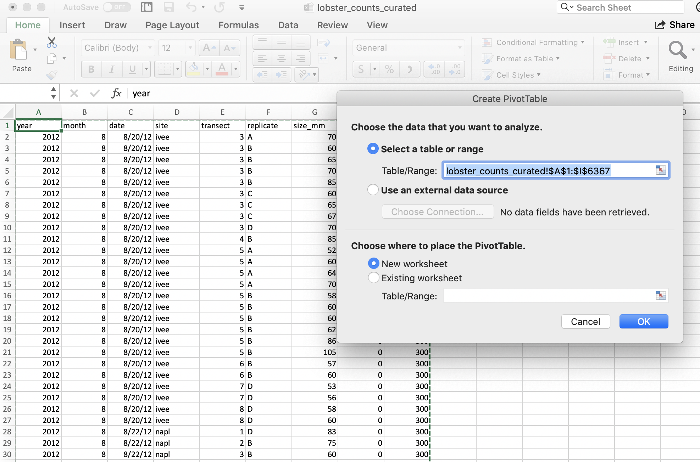
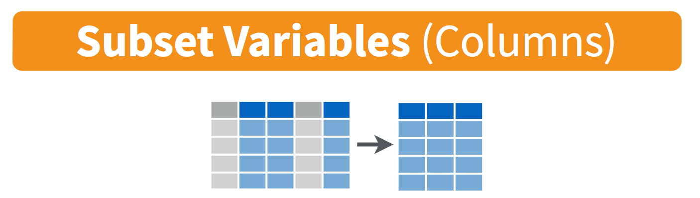

# Pivot Tables with `dplyr` {#pivot-tables}

<!---
Why would you ever want to uncount? You don’t want to assume how future you will want to use this data
How easy is it to get these counts by different groupings
--->

## Summary

Pivot tables are powerful tools in Excel for summarizing data in different ways. We will create these tables using the `group_by` and `summarize` functions from the `dplyr` package (part of the Tidyverse). We will also learn how to format tables and practice creating a reproducible report using RMarkdown and sharing it with GitHub. 

**Data used in the synthesis section:**  

- File name: lobsters.xlsx and lobsters2.xlsx  
- Description: Lobster size, abundance and fishing pressure (Santa Barbara coast)  
- Link: https://portal.edirepository.org/nis/mapbrowse?scope=knb-lter-sbc&identifier=77&revision=newest  
- Citation: Reed D. 2019. SBC LTER: Reef: Abundance, size and fishing effort for California Spiny Lobster (Panulirus interruptus), ongoing since 2012. Environmental Data Initiative. [doi](https://doi.org/10.6073/pasta/a593a675d644fdefb736750b291579a0). 


### Objectives

In R, we can use the `dplyr` package for pivot tables by using 2 functions `group_by` and `summarize` together with the pipe operator `%>%`. We will also continue to emphasize reproducibility in all our analyses.

- Discuss pivot tables in Excel
- Introduce `group_by() %>% summarize()` from the `dplyr` package
- Learn `mutate()` and `select()` to work column-wise
- Practice our reproducible workflow with RMarkdown and GitHub

### Resources

- [`dplyr` website: dplyr.tidyverse.org](https://dplyr.tidyverse.org/)
- [R for Data Science: Transform Chapter](https://r4ds.had.co.nz/transform.html) by Hadley Wickham & Garrett Grolemund
- [Intro to Pivot Tables I-III videos](https://youtu.be/g530cnFfk8Y) by Excel Campus
- [Data organization in spreadsheets](https://peerj.com/preprints/3183/) by Karl Broman & Kara Woo

## Overview & setup

[Wikipedia describes a pivot table](https://en.wikipedia.org/wiki/Pivot_table) as a "table of statistics that summarizes the data of a more extensive table...this summary might include sums, averages, or other statistics, which the pivot table groups together in a meaningful way." 

> **Aside:** Wikipedia also says that "Although pivot table is a generic term, Microsoft trademarked PivotTable in the United States in 1994."

Pivot tables are a really powerful tool for summarizing data, and we can have similar functionality in R — as well as nicely automating and reporting these tables. 

We will first have a look at our data, demo using pivot tables in Excel, and then create reproducible tables in R. 

### View data in Excel

When reading in Excel files (or really any data that isn't yours), it can be a good idea to open the data and look at it so you know what you're up against. 

Let's open the lobsters.xlsx data in Excel. 

It's one sheet, and it's rectangular. In this data set, every row is a unique observation. This is called "uncounted" data; you'll see there is no row for how many lobsters were seen because each row is an observation, or an "n of 1". 

But also notice that the data doesn't start until line 5; there are 4 lines of metadata — data about the data that is super important! — that we don't want to muddy our analyses. 

Now your first idea might be to delete these 4 rows from this Excel sheet and save them on another, but we also know that we need to keep the raw data raw. So let's not touch this data in Excel, we'll remove these lines in R. Let's do that first so then we'll be all set. 

### RMarkdown setup

Let's start a new RMarkdown file in our repo, at the top-level (where it will be created by default in our Project). I'll call mine `pivot_lobsters.Rmd`. 

In the setup chunk, let's attach our libraries and read in our lobster data. In addition to the `tidyverse` package we will also use the `skimr` package. You will have to install it, but don't want it to be installed every time you write your code. The following is a nice convention for having the install instructions available (on the same line) as the `library()` call. 

```{r setup, message=FALSE}
## attach libraries
library(tidyverse)
library(readxl)
library(here)
library(skimr) # install.packages('skimr')
library(kableExtra) # install.packages('kableExtra')
```

We used the `read_excel()` before, which is the generic function that reads both .xls and .xlsx files. Since we know that this is a .xlsx file, we will demo using the `read_xlsx()` function. 

We can expect that someone in the history of R and especially the history of the `readxl` package has needed to skip lines at the top of an Excel file before. So let's look at the help pages `?read_xlsx`: there is an argument called `skip` that we can set to 4 to skip 4 lines. 


```{r read-xl-skip}
## read in data
lobsters <- read_xlsx(here("data/lobsters.xlsx"), skip=4)
```

Great. We've seen this data in Excel so I don't feel the need to use `head()` here like we've done before, but I do like having a look at summary statistics and classes. 

#### `skimr::skim`

To look at summary statistics we've used `summary`, which is good for numeric columns, but it doesn't give a lot of useful information for non-numeric data. So it means it wouldn't tell us how many unique sites there are in this dataset. To have a look there I like using the `skimr` package: 

```{r skim-lobsters, eval=FALSE}
# explore data
skimr::skim(lobsters) 
```

This `skimr::` notation is a reminder to me that `skim` is from the `skimr` package. It is a nice convention: it's a reminder to others (especially you!).

`skim` lets us look more at each variable. Here we can look at our character variables and see that there are 5 unique sites (in the `n_unique` output). Also, I particularly like looking at missing data. There are 6 missing values in the `size_mm` variable.

### Our task

So now we have an idea of our data. But now we have a task: we've been asked by a colleague to report about how the average size of lobsters has changed for each site across time.  

We will complete this task with R by using the `dplyr` package for data wrangling, which we will do after demoing how this would do it with pivot tables in Excel.

## Pivot table demo

I will demo how we will make a pivot table with our lobster data. You are welcome to sit back and watch rather than following along.

First let's summarize how many lobsters were counted each year. This means I want to count of rows by year.

So to do this in Excel we would initiate the Pivot Table Process: 

<br>

```{r, echo=FALSE, out.width="60%"}
knitr::include_graphics("img/pivot-table-menu.png")  
```

<br>

Excel will ask what data I would like to include, and it will do its best to suggest coordinates for my data within the spreadsheet (it can have difficulty with non-rectangular or "non-tidy" data). It does a good job here of ignoring those top lines of data description. 

It will also suggest we make our PivotTable in a new worksheet. 

<br>

```{r, echo=FALSE, out.width="60%"}
  
```

<br>

And then we'll see our new sheet and a little wizard to help us create the PivotTable. 

### pivot one variable

I want to start by summarizing by year, so I first drag the `year` variable down into the "Rows" box. What I see at this point are the years listed: this confirms that I'm going to group by years. 

<br>

```{r, echo=FALSE, out.width="60%"}
knitr::include_graphics("img/pivot-table-count-year-groupby.png")  
```

<br>

And then, to summarize the counts for each year, I actually drag the same `year` variable into the "Values" box. And it will create a Pivot Table for me! But "sum" as the default summary statistic; this doesn't make a whole lot of sense for summarizing years. I can click the little "I" icon to change this summary statistic to what I want: Count of year.

<br>

```{r, echo=FALSE, out.width="60%"}
knitr::include_graphics("img/pivot-table-count-year.png")  
```

<br>

A few things to note: 

- The pivot table is separate entity from our data (it's on a different sheet); the original data has not been affected. This "keeps the raw data raw", which is great practice.
- The pivot table summarizes on the variables you request meaning that we don't see other columns (like date, month, or site). 
- Excel also calculates the Grand total for all sites (in bold). This is nice for communicating about data. But it can be problematic in the future, because it might not be clear that this is a calculation and not data. It could be easy to take a total of this column and introduce errors by doubling the total count. 

So pivot tables are great because they summarize the data and keep the raw data raw — they even promote good practice because they by default ask you if you'd like to present the data in a new sheet rather than in the same sheet.  

### pivot two variables

We can include multiple variables in our PivotTable. If we want to add site as a second variable, we can drag it down: 

```{r, echo=FALSE, out.width="60%"}
knitr::include_graphics("img/pivot-table-count-year-site.png")  
```

But this is comparing sites within a year; we want to compare years within a site. We can reverse the order easily enough by dragging (you just have to remember to do all of these steps the next time you'd want to repeat this): 

```{r, echo=FALSE, out.width="60%"}
knitr::include_graphics("img/pivot-table-count-site-year.png")  
```

So in terms of our full task, which is to compare the average lobster size by site and year, we are on our way! I'll leave this as a cliff-hanger here in Excel and we will carry forward in R. 

Just to recap what we did here: we told Excel we wanted to group by something (here: `year` and `site`) and then summarize by something (here: count, not sum!)

<!---
All verbs work similarly:

1. The first argument is a data frame.
2. The subsequent arguments describe what to do with the data frame. You can refer to columns in the data frame directly without using `$`.
3. The result is a new data frame.

Together these properties make it easy to chain together multiple simple steps to achieve a complex result using the pipe operator `%>%`.

I love thinking of these `dplyr` verbs and the pipe operator `%>%` as telling a story. When I see `%>%` I think "and then":

```{r, eval=FALSE}
data %>%          # start with data, and then
  group_by() %>%  # group by a variable, and then
  mutate() %>%    # mutate to add a new column, and then
  select()        # select specific columns
```


--->
## `group_by()` %>% `summarize()`

In R, we can create the functionality of pivot tables with the same logic: we will tell R to group by something and then summarize by something. Visually, it looks like this: 

<br>
```{r, echo=FALSE, out.width="80%"}
knitr::include_graphics("img/rstudio-cheatsheet-group_by_summarize.png")  
```
<br>

This graphic is from [RStudio's old-school data wrangling cheatsheet](http://www.rstudio.com/wp-content/uploads/2015/02/data-wrangling-cheatsheet.pdf); all cheatsheets available from <https://rstudio.com/resources/cheatsheets>). It's incredibly powerful to visualize what we are talking about with our data when do do these kinds of operations.

And in code, it looks like this: 

```{r, eval=FALSE}
data %>%
  group_by() %>% 
  summarize()
```
  
It reads: “Take the data and then group by something and then summarize by something”. 

The pipe operator `%>%` is a really critical feature of the `dplyr` package, originally created for the `magrittr` package. It lets us chain together steps of our data wrangling, enabling us to tell a clear story about our entire data analysis. This is not only a written story to archive what we've done, but it will be a reproducible story that can be rerun and remixed. It is not difficult to read as a human, and it is not a series of clicks to remember. 
Let's try it out!

### `group_by` one variable

Let's use `group_by() %>% summarize()` with our `lobsters` data, just like we did in Excel.  We will first group_by year and then summarize by count, using the function `n()` (in the `dplyr` package). `n()` counts the number of times an observation shows up, and since this is uncounted data, this will count each row. 

We can say this out loud while we write it: "take the lobsters data and then group_by year and then summarize by count in a new column we'll call `count_by_year`". 


```{r eval=FALSE}
lobsters %>%
  group_by(year) %>%
  summarize(count_by_year = n())
```


Notice how together, `group_by` and `summarize` minimize the amount of information we see. We also saw this with the pivot table. We lose the other columns that aren't involved here. 

Question: What if you *don't* group_by first? Let's try it and discuss what's going on.

```{r}
lobsters %>%
  summarize(count =  n())
```

So if we don't `group_by` first, we will get a single summary statistic (sum in this case) for the whole dataset. 

Another question: what if we *only* group_by? 

```{r}
lobsters %>%
  group_by(year)
```

R doesn't summarize our data, but you can see from the output that it is indeed grouped. However, we haven't done anything to the original data: we are only exploring. We are keeping the raw data raw.

To convince ourselves, let's now check the `lobsters` variable. We can do this by clicking on `lobsters` in the Environment pane in RStudio. 

We see that we haven't changed any of our original data that was stored in this variable. (Just like how the pivot table didn't affect the raw data on the original sheet). 

> ***Aside***: You'll also see that when you click on the variable name in the Environment pane, `View(lobsters)` shows up in your Console. `View()` (capital V) is the R function to view any variable in the viewer. So this is something that you can write in your RMarkdown script, although RMarkdown will not be able to knit this view feature into the formatted document. So, if you want include `View()` in your RMarkdown document you will need to either comment it out `#View()` or add `eval=FALSE` to the top of the code chunk so that the full line reads `{r, eval=FALSE}`. 

### `group_by` multiple variables

Great. Now let's summarize by both year and site like we did in the pivot table. We are able to `group_by` more than one variable. Let's do this together:

```{r, eval=FALSE}
lobsters %>%
  group_by(site, year) %>%
  summarize(count_by_siteyear =  n())
```

We put the site first because that is what we want as an end product. But we could easily have put year first. We saw visually what would happen when we did this in the Pivot Table. 

Great.

### `summarize` multiple variables

We can summarize multiple variables at a time. 

So far we've summarized the count of lobster observations. Let's also calculate the mean and standard deviation. First let's use the `mean()` function to calculate the mean. We do this within the same `summarize()` function, but we can add a new line to make it easier to read. Notice how when you put your curser within the parenthesis and hit return, the indentation will automatically align. 

```{r, eval=FALSE}
lobsters %>%
  group_by(site, year) %>%
  summarize(count_by_siteyear =  n(),
            mean_size_mm = mean(size_mm))
```

> ***Aside*** Command-I will properly indent selected lines.

Great! But this will actually calculate some of the means as NA because one or more values in that year are NA. So we can pass an argument that says to remove NAs first before calculating the average. Let's do that, and then also calculate the standard deviation with the `sd()` function:

```{r, eval=FALSE}
lobsters %>%
  group_by(site, year) %>%
  summarize(count_by_siteyear =  n(), 
            mean_size_mm = mean(size_mm, na.rm=TRUE), 
            sd_size_mm = sd(size_mm, na.rm=TRUE))
```

So we can make the equivalent of Excel's pivot table in R with `group_by() %>% summarize()`.

Now we are at the point where we actually want to save this summary information as a variable so we can use it in further analyses and formatting.

So let's add a variable assignment to that first line:

```{r, results=FALSE}
siteyear_summary <- lobsters %>%
  group_by(site, year) %>%
  summarize(count_by_siteyear =  n(), 
            mean_size_mm = mean(size_mm, na.rm = TRUE), 
            sd_size_mm = sd(size_mm, na.rm = TRUE))

## inspect our new variable 
siteyear_summary 
```

### Table formatting with `kable()`

There are several options for formatting tables in RMarkdown; we'll show one here from the `kableExtra` package and learn more about it tomorrow. 

It works nicely with the pipe operator, so we can build do this from our new object:

```{r, eval=FALSE}
## make a table with our new variable
siteyear_summary %>%
  kable()
```

### R code in-line in RMarkdown

Before we let you try this on your own, let's go outside of our code chunk and write in Markdown. 

I want to demo something that is a really powerful RMarkdown feature that we can already leverage with what we know in R.

Write this **in Markdown** but replace the # with a backtick (`): "There are #r nrow(lobsters)# total lobsters included in this report." Let's knit to see what happens. 

I hope you can start to imagine the possibilities. If you wanted to write which year had the most observations, or which site had a decreasing trend, you would be able to. 

### Activity

1. Build from our analysis and calculate the median lobster size for each site year. Your calculation will use the `size_mm` variable and function to calculate the median (Hint: ?median)
1. create and ggsave() a plot. 

Then, save, commit, and push your .Rmd, .html, and .png. 

Solution (no peeking): 
```{r, results=FALSE}
siteyear_summary <- lobsters %>%
  group_by(site, year) %>%
  summarize(count_by_siteyear =  n(), 
            mean_size_mm = mean(size_mm, na.rm = TRUE), 
            sd_size_mm = sd(size_mm, na.rm = TRUE), 
            median_size_mm = median(size_mm, na.rm = TRUE))

## a ggplot option:
ggplot(data = siteyear_summary, aes(x = year, y = median_size_mm, color = site)) +
  geom_line() 
ggsave(here("figures", "lobsters-line.png"))


## another option:
ggplot(siteyear_summary, aes(x = year, y = median_size_mm)) +
  geom_col() +
  facet_wrap(~site)
ggsave(here("figures", "lobsters-col.png"))
```


Don't forget to knit, commit, and push!

Nice work everybody. 

## Oh no, they sent the wrong data!

Oh no! After all our analyses and everything we've done, our colleague just emailed us at 4:30pm on Friday that he sent the wrong data and we need to redo all our analyses with a new .xlsx file: `lobsters2.xlsx`, not `lobsters.xlsx`. Aaaaah! 

If we were doing this in Excel, this would be a bummer; we'd have to rebuild our pivot table and click through all of our logic again. And then export our figures and save them into our report.

But, since we did it in R, we are much safer. R's power is not only in analytical power, but in automation and reproducibility. 

This means we can go back to the top of our RMarkdown file, and read in this new data file, and then re-knit. We will still need to check that everything outputs correctly, (and that column headers haven't been renamed), but our first pass will be to update the filename and re-knit: 

```{r, message=FALSE}
## read in data
lobsters <- read_xlsx(here("data/lobsters2.xlsx"), skip=4)
```

And now we can see that our plot updated as well: 

```{r, results=FALSE}
siteyear_summary <- lobsters %>%
  group_by(site, year) %>%
  summarize(count_by_siteyear =  n(), 
            mean_size_mm = mean(size_mm, na.rm = TRUE), 
            sd_size_mm = sd(size_mm, na.rm = TRUE), 
            median_size_mm = median(size_mm, na.rm = TRUE), )

siteyear_summary
```

```{r, message=FALSE}
## a ggplot option:
ggplot(data = siteyear_summary, aes(x = year, y = median_size_mm, color = site)) +
  geom_line() 
ggsave(here("figures", "lobsters-line.png"))

## another option:
ggplot(siteyear_summary, aes(x = year, y = median_size_mm)) +
  geom_col() +
  facet_wrap(~site)
ggsave(here("figures", "lobsters-col.png"))
```

### Knit, push, & show differences on GitHub

So cool. 

### `dplyr::count()`

Now that we've spent time with group_by %>% summarize, there is a shortcut if you only want to summarize by count. This is with a function called `count()`, and it will group_by your selected variable, count, and then also ungroup. It looks like this: 

```{r, eval=FALSE}
lobsters %>%
  count(site, year)

## This is the same as:
lobsters %>%
  group_by(site, year) %>% 
  summarize(n = n()) %>%
  ungroup()

```

Hey, we could update our RMarkdown text knowing this: There are #r count(lobsters)# total lobsters included in this summary.

Switching gears...

## `mutate()` 

```{r, echo=FALSE, out.width="80%"}
knitr::include_graphics("img/rstudio-cheatsheet-mutate.png")  
```

<br>

There are a lot of times where you don't want to summarize your data, but you do want to operate beyond the original data. This is often done by adding a column. We do this with the `mutate()` function from `dplyr`. Let's try this with our original lobsters data. The sizes are in millimeters but let's say it was important for them to be in meters. We can add a column with this calculation: 

```{r, eval=FALSE}
lobsters %>%
  mutate(size_m = size_mm / 1000)
```

If we want to add a column that has the same value repeated, we can pass it just one value, either a number or a character string (in quotes). And let's save this as a variable called `lobsters_detailed`

```{r, results=FALSE}
lobsters_detailed <- lobsters %>%
  mutate(size_m = size_mm / 1000, 
         millenia = 2000,
         observer = "Allison Horst")
```

## `select()` 

We will end with one final function, `select`. This is how to choose, retain, and move your data by columns: 

```{r, echo=FALSE, out.width="80%"}
  
```

<br>

Let's say that we want to present this data finally with only columns for date, site, and size in meters. We would do this:

```{r select, eval=FALSE}
lobsters_detailed %>%
  select(date, site, size_m)
```

One last time, let's knit, save, commit, and push to GitHub.


<!---

## Deep thoughts

Highly recommended read: [Broman & Woo: Data organization in spreadsheets](https://peerj.com/preprints/3183/). Practical tips to make spreadsheets less error-prone, easier for computers to process, easier to share

Great opening line: "Spreadsheets, for all of their mundane rectangularness, have been the subject of angst and controversy for decades."


## Efficiency Tip

Command - Z to undo  
Command - Shift - Z to redo

Arrow keys to move letter by letter  
Arrow keys - Shift to highlight letter by letter 

Arrow keys - Option to move word by word
Arrow keys - Option to highlight word by word

Arrow keys - Command to move end to end
Arrow keys - Command to highlight end to end

--->

### END **dplyr-pivot-tables** session!
