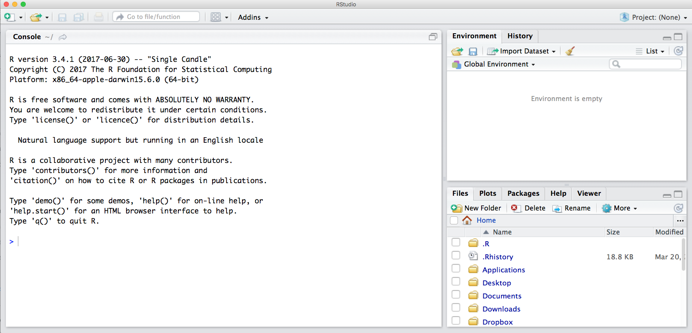

# R & RStudio, RMarkdown {#rstudio}

## Summary

We will begin learning R through RMarkdown, which helps you tell your story of data analysis because you can write text alongside the code. We are actually learning two languages at once: R and Markdown. 

### Objectives 

In this lesson we will get familiar with:

- the RStudio interface
- RMarkdown 
- functions, packages, help pages, and error messages
- assigning variables and commenting
- configuring GitHub with RStudio

### Resources

- [What is RMarkdown?](https://vimeo.com/178485416) awesome 1-minute video by RStudio
- [R for Data Science](http://r4ds.had.co.nz/) by Hadley Wickham and Garrett Grolemund
- [STAT 545](http://stat545.com/) by Jenny Bryan
- [Happy Git with R](http://happygitwithr.com) by Jenny Bryan
- [R for Excel Users](https://blog.shotwell.ca/posts/r_for_excel_users/) by Gordon Shotwell
- [Welcome to the tidyverse](https://joss.theoj.org/papers/10.21105/joss.01686) by Hadley Wickham et al.

<!---
- Broman & Woo 2017: https://www.tandfonline.com/doi/full/10.1080/00031305.2017.1375989
--->

## RStudio Orientation

What is the RStudio IDE (integrated development environment)? The RStudio IDE is software that greatly improves your R experience. 

I think that **R is your airplane, and the RStudio IDE is your airport**. You are the pilot, and you use R to go places! With practice you'll gain skills and confidence; you can fly further distances and get through tricky situations. You will become an awesome pilot and can fly your plane anywhere. And the RStudio IDE provides support! Runways, communication, community, and other services that makes your life as a pilot much easier. It provides not only the infrastructure but a hub for the community that you can interact with. 

To launch RStudio, double-click on the RStudio icon. Launching RStudio also launches R, and you will probably never open R by itself. 

```{r, echo=FALSE, out.width="80%"}
  
```

Notice the default panes:

  * Console (entire left)
  * Environment/History (tabbed in upper right)
  * Files/Plots/Packages/Help (tabbed in lower right)

We won't click through this all immediately but we will become familiar with more of the options and capabilities throughout the next few days.

Something critical to know now is that you can make everything you see BIGGER by going to the navigation pane: View > Zoom In. Learn these keyboard shortcuts; being able to see what you're typing will help avoid typos & help us help you.


<!---
FYI: you can change the default location of the panes, among many other things: [Customizing RStudio](https://support.rstudio.com/hc/en-us/articles/200549016-Customizing-RStudio). 
--->

An important first question: **where are we?** 

If you've have opened RStudio for the first time, you'll be in your Home directory. This is noted by the `~/` at the top of the console. You can see too that the Files pane in the lower right shows what is in the Home directory where you are. You can navigate around within that Files pane and explore, but note that you won't change where you are: even as you click through you'll still be Home: `~/`. 

```{r, echo=FALSE, out.width="80%"}
knitr::include_graphics("img/RStudio_IDE_homedir.png")  
```

We are going to have our first experience with R through RMarkdown, so let's do the following.

## Intro to RMarkdown

An RMarkdown file is a plain text file that allow us to write code and text together, and when it is "knit", the code will be evaluated and the text formatted so that it creates a reproducible report or document that is nice to read as a human.

This is really critical to reproducibility, and it also saves time. This document will recreate your figures for you in the same document where you are writing text. So no more doing analysis, saving a plot, pasting that plot into Word, redoing the analysis, re-saving, re-pasting, etc. 

This 1-minute video does the best job of introducing RMarkdown: [What is RMarkdown?](https://vimeo.com/178485416). 

Now let's experience this a bit ourselves and then we'll talk about it more. 

### Create an RMarkdown file

Let's do this together:

File -> New File -> RMarkdown... (or alternatively you can click the green plus in the top left -> RMarkdown). 

Let's title it "Testing" and write our name as author, then click OK with the recommended Default Output Format, which is HTML.

```{r, echo=FALSE, out.width="80%"}
knitr::include_graphics("img/rstudio_new-rmd-doc-html.png")  
```

OK, first off: by opening a file, we are seeing the 4th pane of the RStudio console, which here is a text editor. This lets us dock and organize our files within RStudio instead of having a bunch of different windows open (but there are options to pop them out if that is what you prefer).

Let's have a look at this file — it's not blank; there is some initial text is already provided for you. Let's have a high-level look through of it: 

- The top part has the Title and Author we provided, as well as today's date and the output type as an HTML document like we selected above.
- There are white and grey sections. These are the 2 main languages that make up an RMarkdown file. 
  - **Grey sections are R code**
  - **White sections are Markdown text**
- There is black and blue text (we'll ignore the green text for now).  
  
```{r, echo=FALSE, out.width="80%"}
knitr::include_graphics("img/rmarkdown.png")  
```

### Knit your RMarkdown file

Let's go ahead and "Knit" by clicking the blue yarn at the top of the RMarkdown file. 
It's going to ask us to save first, I'll name mine "testing.Rmd". Note that this is by default going to save this file in your home directory `/~`. Since this is a testing document this is fine to save here; we will get more organized about where we save files very soon. Once you click Save, the knit process will be able to continue.

OK so how cool is this, we've just made an html file! This is a single webpage that we are viewing locally on our own computers. Knitting this RMarkdown document has rendered — we also say formatted — both the Markdown text (white) and the R code (grey), and the it also executed — we also say ran — the R code.  

Let's have a look at them side-by-side: 

<br>

```{r, echo=FALSE, out.width="80%"}
knitr::include_graphics("img/rmarkdown_side_by_side.png")  
```

Let's take a deeper look at these two files. So much of learning to code is looking for patterns.

#### Activity

Introduce yourself to the person sitting next to you. Discuss what you notice with these two files. Then we will have a brief share-out with the group. (5 mins)

### Markdown text

Let's look more deeply at the Markdown text. Markdown is a formatting language for plain text, and there are only a handful of rules to know. 

Notice the syntax for:

- **headers** with `#` or `##`
- **bold** with `**`

To see more of the rules, let's look at RStudio's built-in reference. Let's do this: Help > Markdown Quick Reference

There are also good [cheatsheets](https://github.com/adam-p/markdown-here/wiki/Markdown-Here-Cheatsheet) available online.

<!---
#### Activity

1. In Markdown write some italic text, make a numbered list, and add a few subheaders.
 Use the Markdown Quick Reference (in the menu bar: Help > Markdown Quick Reference). 
1. Reknit your html file. 
--->

### R code

Let's look at the R code that we see executed in our knitted document. 

We see that:

- `summary(cars)` produces a table with information about cars
- `plot(pressure)` produces a plot with information about pressure

There are a couple of things going on here. 

`summary()` and `plot()` are called **functions**; they are operations and these ones come installed with R. We call functions installed with R **base R functions**. This is similar to Excel's functions and formulas. 

`cars` and `pressure` are small datasets that come installed with R. 

We'll talk more about functions and data shortly. 

### Code chunks

R code is written in code chunks, which are grey. 
<!---There are two things to look at: R code chunks and code chunk options --->

Each of them start with 3 backticks and `{r label}` that signify there will be R code following. Anything inside the brackets (`{ }`) is instructions for RMarkdown about that code to run. For example:

- the first chunk labeled "setup" says `include=FALSE`, and we don't see it included in the HTML document. 
- the second chunk labeled "cars" has no additional instructions, and in the HTML document we see the code and the evaluation of that code (a summary table)
- the third chunk labeled "pressure" says `echo=FALSE`, and in the HTML document we do not see the code echoed, we only see the plot when the code is executed.

> **Aside: Code chunk labels** It is possible to label your code chunks. This is to help us navigate between them and keep them organized. In our example Rmd, our  three chunks say `r` as the language, and have a label (`setup`, `cars`, `pressure`).   
> Labels are optional, but will become powerful as you become a powerful R user. But if you label your code chunks, you must have unique labels. So while a third option for creating a new code chunk is to copy-paste-edit an existing one, you'll have to remember to relabel it something unique. We will explore this more in a moment.

Notice how the word `FALSE` is all capitals. Capitalization matters in R; `TRUE/FALSE` is something that R can interpret as a binary yes/no or 1/0. 

There are many more options available that we will discuss as we get more familiar with RMarkdown.

#### New code chunks

We can create a new chunk in your RMarkdown first in one of these ways: 

- click "Insert > R" at the top of the editor pane (with the green plus and green box)
- type it by hand: 
   \```{r}
   \```

> **Aside**: doesn't have to be only R, other languages supported. 

Let's create a new code chunk at the end of our document.

Now, let's write some code in R. Let's say we want to see the summary of the `pressure` data. I'm going to press enter to to add some extra carriage returns because sometimes I find it more pleasant to look at my code, and it helps in troubleshooting, which is often about identifying typos. R lets you use as much whitespace as you would like.

```{r, eval=FALSE}

summary(pressure)

```

We can knit this and see the summary of `pressure`. This is the same data that we see with the plot just above. 

> Troubleshooting: Did trying to knit your document produce an error? Start by looking at your code again. Do you have both open `(` and close `)` parentheses? Are your code chunk fences (```) correct?

## R code in the Console

So far we have been telling R to execute our code only when we knit the document, but we can also write code in the Console to interact with the live R process.

The Console (bottom left pane of the RStudio IDE) is where you can interact with the R engine and run code directly. 

Let's type this in the Console: `summary(pressure)` and hit enter. We see the pressure summary table returned; it is the same information that we saw in our knitted html document. By default, R will display (we also say "print") the executed result in the Console 

```{r, eval=FALSE}
summary(pressure)
```

We can also do math as we can in Excel: type the following and press enter.

```{r, eval=FALSE}
8*22.3
```

### Error messages

When you code in R or any language, you will encounter errors. We will discuss troubleshooting tips more deeply tomorrow in [Collaborating & getting help](#collaboration); here we will just get a little comfortable with them. 

#### R error messages

**Error messages are your friends**. 

What do they look like? I'll demo typing in the Console `summary(pressur)`

``` r
summary(pressur)
#> Error in summary(pressur): object 'pressur' not found
```

Error messages are R's way of saying that it didn't understand what you said. This is like in English when we say "What?" or "Pardon?" And like in spoken language, some error messages are more helpful than others. Like if someone says "Sorry, could you repeat that last word" rather than only "What?"

In this case, R is saying "I didn't understand `pressur`". R tracks the datasets it has available as objects, as well as any additional objects that you make. `pressur` is not among them, so it says that it is not found. 

The first step of becoming a proficient R user is to move past the exasperation of "it's not working!" and **read the error message**. Errors will be less frustrating with the mindset that **most likely the problem is your typo or misuse**, and not that R is broken or hates you. Read the error message to learn what is wrong. 

#### RMarkdown error messages

Errors can also occur in RMarkdown. I said a moment ago that you label your code chunks, they need to be unique. Let's see what happens if not. If I (re)name our `summary(pressure)` chunk to "pressure", I will see an error when you try to knit: 

```
processing file: testing.Rmd
Error in parse_block(g[-1], g[1], params.src) : duplicate label 'cars'
Calls: <Anonymous> ... process_file -> split_file -> lapply -> FUN -> parse_block
Execution halted
```

There are two things to focus on here. 

First: This error message starts out in a pretty cryptic way: I don't expect you to know what `parse_block(g[-1]...` means. But, expecting that the error message is really trying to help me, I continue scanning the message which allows me to identify the problem: `duplicate label 'cars'`. 

Second: This error is in the "R Markdown" tab on the bottom left of the RStudio IDE; it is not in the Console. That is because when RMarkdown is knitted, it actually spins up an R workspace separately from what is passed to the Console; this is one of the ways that R Markdown enables reproducibility because it is a self-contained instance of R. 

You can click back and forth between the Console and the R Markdown tab; this is something to look out for as we continue. We will work in the Console and R Markdown and will discuss strategies for where and how to work as we go. Let's click back to Console now. 

### Running RMarkdown code chunks 

So far we have written code in our RMarkdown file that is executed when we knit the file. We have also written code directly in the Console that is executed when we press enter/return. Additionally, we can write code in an RMarkdown code chunk and execute it by sending it into the Console (i.e. we can execute code without knitting the document). 

How do we do it? There are several ways. Let's do each of these with `summary(pressure)`.

**First approach: send R code to the Console.**
This approach involves selecting (highlighting) the R code only (`summary(pressure)`), not any of the backticks/fences from the code chunk. (If you see `Error: attempt to use zero-length variable name` it is because you have accidentally highlighted the backticks along with the R code. Try again (and don't forget that you can add spaces within the code chunk or make your RStudio session bigger (View > Zoom In)). 

Do this by selecting code and then: 

1. copy-pasting into the Console and press enter/return.
1. clicking 'Run' from RStudio IDE. This is available from: 
    a. the bar above the file (green arrow)
    b. the menu bar: Code > Run Selected Line(s)
    c. keyboard shortcut: command-return

**Second approach: run full code chunk.**
Since we are already grouping relevant code together in chunks, it's reasonable that we might want to run it all together at once. 

Do this by placing your curser within a code chunk and then: 

1. clicking the little black down arrow next to the Run green arrow and selecting Run Current Chunk. Notice there are also options to run all chunks, run all chunks above or below...

### Writing code in a file vs. Console

<!---TODO more --->

When should you write code in a file (.Rmd or .R script) and when should you write it in the Console? 

We write things in the file that are necessary for our analysis and that we want to preserve for reproducibility; we will be doing this throughout the workshop to give you a good sense of this. A file is also a great way for you to take notes to yourself. 

The Console is good for doing quick calculations like `8*22.3`, testing functions, for calling help pages, for installing packages. We'll explore these things next. 


## R functions

Like Excel, the power of R comes not from doing small operations individually (like `8*22.3`). R's power comes from being able to operate on whole suites of numbers and datasets. 

And also like Excel, some of the biggest power in R is that there are built-in functions that you can use in your analyses (and, as we'll see, R users can easily create and share functions, and it is this open source developer and contributor community that makes R so awesome).

R has a mind-blowing collection of built-in functions that are used with the same syntax: function name with parentheses around what the function needs to do what it is supposed to do.

We've seen a few functions already: we've seen `plot()` and `summary()`. 

Functions always have the same structure: a name, parentheses, and arguments that you can specify. `function_name(arguments)`. Let's see a few more examples. 

Like in Excel, there is a function called "sum" to calculate a total. In R, it is spelled lowercase: `sum()`. (As I type in the Console, R will provide suggestions). 

Let's use the `sum()` function to calculate the sum of all the distances traveled in the `cars` dataset. We specify a single column of a dataset using the `$` operator:

```{r sum-cars, eval=FALSE}
sum(cars$dist)
```

Another function is simply called `c()`; which combines values together. 

So let's create a new R code chunk. And we'll write: 

```{r c-example}
c(1, 7:9)
```


> Aside: some functions don't require arguments: try typing `date()` into the Console. Be sure to type the parentheses (`date()`); otherwise R will return the code behind the `date()` function rather than the output that you want/expect.

So you can see that this combines these values all into the same place, which is called a vector here. We could also do this with a non-numeric examples, which are called "strings":

```{r c-ex2}
c("San Francisco", "Cal Academy") 
```

We need to put quotes around non-numeric values so that R does not interpret them as an object. It would definitely get grumpy and give us an error that it did not have an object by these names. And you see that R also prints in quotes. 

We can also put functions inside of other functions. This is called nested functions. When we add another function inside a function, R will evaluate them from the inside-out. 

```{r c-ex3}
c(sum(cars$dist), "San Francisco", "Cal Academy") 
```

So R first evaluated the `sum(cars$dist)`, and then evaluates the `c()` statement.

This example demonstrates another key idea in R: the idea of **classes**. The output R provides is called a vector, and everything within that vector has to be the same type of thing: we can't have both numbers and words inside. So here R is able to first calculate `sum(cars$dist)` as a number, but then `c()` will turn that number into a text, called a "string" in R: you see that it is in quotes. It is no longer a numeric, it is a string. 

This is a big difference between R and Excel, since Excel allows you to have a mix of text and numeric in the same column or row. R's way can feel restrictive, but it is also more predictable. In Excel, you might have a single number in your whole sheet that Excel is silently interpreting as text so it is causing errors in the analyses. In R, the whole column will be the same type. This can still cause trouble, but that is where the good practices that we are learning together can help minimize that kind of trouble.

We will not discuss classes or work with nested functions very much in this workshop (the tidyverse design and pipe operator make nested functions less prevalent). But we wanted to introduce them to you because they will be something you encounter as you continue on your journey with R. 

<!---
From Gordon Shotwell's blog:
>Excel has only one basic data structure: the cell. Cells are extremely flexible in that they can store numeric, character, logical or formula information. The cost of this flexibility is unpredictability. For instance you can store the character “6” in a cell when you mean to store the number 6. The basic R data structure is a vector. You can think of a vector like a column in an Excel spreadsheet with the limitation that all the data in that vector must be of the same type. If it is a character vector, every element must be a character; if it is a logical vector, every element must be TRUE or FALSE; if it’s numeric you can trust that every element is a number. There’s no such constraint in Excel: you might have a column which has a bunch of numbers, but then some explanatory test intermingled with the numbers. This isn’t allowed in R.

--->

## Help pages
 
Every function available to you should have a help page, and you access it by typing a question mark preceding the function name in the Console. 

Let's have a deeper look at the arguments for `plot()`, using the help pages. 

```
?plot
```

This opens up the correct page in the Help Tab in the bottom-right of the RStudio IDE. You can also click on the tab and type in the function name in the search bar. 

All help pages will have the same format, here is how I look at it: 

The help page tells the name of the package in the top left, and broken down into sections:

> Help pages  
 - Description: An extended description of what the function does.
 - Usage: The arguments of the function and their default values.
 - Arguments: An explanation of the data each argument is expecting.
 - Details: Any important details to be aware of.
 - Value: The data the function returns.
 - See Also: Any related functions you might find useful.
 - Examples: Some examples for how to use the function.

When I look at a help page, I start with the Description to see if I am in the right place for what I need to do. Reading the description for `plot` lets me know that yup, this is the function I want.

I next look at the usage and arguments, which give me a more concrete view into what the function does. `plot` requires arguments for `x` and `y`. But we passed only one argument to `plot()`: we passed the cars dataset (`plot(cars)`). R is able to understand that it should use the two columns in that dataset as x and y, and it does so based on order: the first column "speed" becomes x and the second column "dist" becomes y. The `...` means that there are many other arguments we can pass to `plot()`, which we should expect: I think we can all agree that it would be nice to have the option of making this figure a little more beautiful and compelling. Glancing at some of the arguments, we can understand here to be about the style of the plots.

Next, I usually scroll down to the bottom to the examples. This is where I can actually see how the function is used, and I can also paste those examples into the Console to see their output. Let's try it:

```{r plot-help-example}
plot(sin, -pi, 2*pi)
```

## Commenting

I've been working in the Console to illustrate working interactively with the live R process. But it is likely that you may want to write some of these things as notes in your R Markdown file. That's great! 

But you may not want everything you type to be run when you knit your document. So you can tell R not to run something by "commenting it out". This is done with one or more pound/hash/number signs: `#`. So if I wanted to write a note to myself about using `?` to open the help pages, I would write this in my R Markdown code chunk: 

```{r commenting}
## open help pages with ?:
# ?plot
```

RStudio color-codes comments as green so they are easier to see. 

Notice that my convention is to use two `##`'s for my notes, and only one for the code that I don't want to run now, but might want to run other times. I like this convention because in RStudio you can uncomment/recomment multiple lines of code at once if you use just one `#`: do this by going to the menu Code > Comment/Uncomment Lines (keyboard shortcut on my Mac: Shift-Command-C).

> **Aside**: Note also that the hashtag `#` is used differently in Markdown and in R. In R, a hashtag indicates a comment that will not be evaluated. You can use as many as you want: `#` is equivalent to `######`. In Markdown, a hashtag indicates a level of a header. And the number you use matters: `#` is a "level one header", meaning the biggest font and the top of the hierarchy. `###` is a level three header, and will show up nested below the `#` and `##` headers.

## Assigning objects with `<-`

In Excel, data are stored in the spreadsheet. In R, they are stored in objects. Data can be a variety of formats, for example numeric and strings like we just talked about.  

We will be working with data objects that are rectangular in shape. If they only have one column or one row, they are also called a vector. And we assign these objects names. 

This is a big difference with Excel, where you usually identify data by its location on the grid, like `$A1:D$20`. (You can do this with Excel by naming ranges of cells, but many people don’t do this.)

We assign an object a name by writing the name along with the assignment operator `<-`. Let's try it by creating a variable called "x" and assigning it to 10. 

```{r}
x <- 10
```

When I see this written, in my head I hear "x gets 10". 

When we send this to the Console (I do this with Command - Enter), notice how nothing is printed in return. This is because when we assign a variable, by default it is not returned. We can see what x is by typing it in the Console and hitting enter. 

We can also assign objects with existing objects. Let's say we want to have the distance traveled by cars in its own variable, and multiply by 1000 (assuming these data are in km and we want m).

```{r assign}
dist_m <- cars$dist * 1000
```

Object names can be whatever you want, although it is wise to not name objects by functions that you know exist, for example "c" or "false". Additionally, they cannot start with a digit and cannot contain spaces. Different folks have different conventions; you will be wise to adopt a [convention for demarcating words](http://en.wikipedia.org/wiki/Snake_case) in names.

```{r cases}
## i_use_snake_case
## other.people.use.periods
## evenOthersUseCamelCase
## also-there-is-kebab-case
```

```{r, echo=FALSE, out.width="80%"}
knitr::include_graphics("img/horst_coding_cases.png")  
```


## R Packages

So far we've been using a couple functions that are included with R out-of-the-box such as `plot()` and `c()`. We say that these functions are from "Base R". But, one of the amazing things about R is that a vast user community is always creating new functions and packages that expand R's capabilities.  

In R, the fundamental unit of shareable code is the package. A package bundles together code, data, documentation (including to create the help pages), and tests, and is easy to share with others. They increase the power of R by improving existing base R functionalities, or by adding new ones. 

The traditional place to download packages is from CRAN, the [Comprehensive R Archive Network](https://cran.r-project.org/), which is where you downloaded R. CRAN is like a grocery store or iTunes for vetted R packages.

> **Aside**: You can also install packages from GitHub; see [`devtools::install_github()`](https://devtools.r-lib.org/)

You don't need to go to CRAN's website to install packages, this can be accomplished within R using the command `install.packages("package-name-in-quotes")`. 

### How do you know what packages/functions exist? 

How do you know what packages exist? Well, how do you know what movies exist on iTunes? You learn what's available based on your needs, interests the community around you. We'll introduce you to several really powerful packages that we work with and help you find others that might be of interest to you. *provide examples here* <!---TODO--->

### Installing R Packages

Let's install several packages that we will be using shortly. Write this in your R Markdown document and run it: 

```{r install-usethis, eval=FALSE}
## setup packages
install.packages("usethis")
```

And after you run it, comment it out: 

```{r install-usethis2, eval=FALSE}
## setup packages
# install.packages("usethis")
```

Now we've installed the package, but we need to tell R that we are going to use the functions within the `usethis` package. We do this by using the function `library()`.

In my mind, this is analogous to needing to wire your house for electricity: this is something you do once; this is `install.packages`. But then you need to turn on the lights each time you need them (R Session).

It's a nice convention to do this on the same line as your commented-out `install.packages()` line; this makes it easier for someone (including you in a future time or computer) to install the package easily. 

```{r install-usethis3}
## setup packages
library(usethis) # install.packages("usethis")
```

When `usethis` is successfully attached, you won't get any feedback in the Console. So unless you get an error, this worked for you.

Now let's do the same with the `here` package.

```{r}
library(here) # install.packages("here")
# here() starts at /Users/lowndes
```

`here` also successfully attached but isn't quiet about it. It is a "chatty" package; when we attached it did so, and responded with the filepath where we are working from. This is the same as `~/` which we saw earlier. 

Finally, let's install the `tidyverse` package.

```{r install-tidyverse}
# install.packages("tidyverse")
```

"The tidyverse is a coherent system of packages for data manipulation, exploration and visualization that share a common design philosophy." - Joseph Rickert: [What is the tidyverse?](https://rviews.rstudio.com/2017/06/08/what-is-the-tidyverse/), RStudio Community Blog.

This may take a little while to complete.


## GitHub brief intro & config

Before we break, we are going to set up Git and GitHub which we will be using along with R and RStudio for the rest of the workshop. 

Before we do the setup configuration, let me take a moment to talk about what Git and GitHub are. 

It helps me to think of GitHub like Dropbox: you identify folders for GitHub to 'track' and it syncs them to the cloud. This is good first-and-foremost because it makes a back-up copy of your files: if your computer dies not all of your work is gone. But with GitHub, you have to be more deliberate about when syncs are made. This is because GitHub saves these as different versions, with information about who contributed when, line-by-line. This makes collaboration easier, and it allows you to roll-back to different versions or contribute to others' work.

git will track and version your files, GitHub stores this online and enables you to collaborate with others (and yourself). Although git and GitHub are two different things, distinct from each other, we can think of them as a bundle since we will always use them together. 

### Configure GitHub

This set up is a one-time thing! You will only have to do this once per computer. We'll walk through this together. In a browser, go to github.com and to your profile page as a reminder.   

**You will need to remember your GitHub username, the email address you created your GitHub account with, and your GitHub password.** 

We will be using the `use_git_config()` function from the `usethis` package we just installed. Since we already installed and attached this package, type this into your Console: 

```{r usethis, eval=FALSE}
## use_git_config function with my username and email as arguments
use_git_config(user.name = "jules32", user.email = "jules32@example.org")
```

If you see `Error in use_git_config() : could not find function "use_git_config"` please run `library("usethis")`

### Ensure that Git/GitHub/RStudio are communicating

We are going to go through a few steps to ensure the Git/GitHub are communicating with RStudio

#### RStudio: New Project

Click on New Project. There are a few different ways; you could also go to File > New Project..., or click the little green + with the R box in the top left.
also in the File menu).

<br>

```{r, echo=FALSE, out.width="80%"}
knitr::include_graphics("img/new_project1.png")  
```

<br>


#### Select Version Control

<br>

```{r, echo=FALSE, out.width="80%"}
knitr::include_graphics("img/new_project2.png")  
```

<br>

#### Select Git

Since we are using git. 

<br>

```{r, echo=FALSE, out.width="80%"}
knitr::include_graphics("img/new_project3.png")  
```

<br>

Do you see what I see? 

<br>

```{r, echo=FALSE, out.width="80%"}
knitr::include_graphics("img/new_project4b.png")  
```

<br>

If yes, hooray! Time for a break!

If no, we will help you troubleshoot.

1. Double check that GitHub username and email are correct
1. Troubleshooting, starting with [HappyGitWithR's troubleshooting chapter](http://happygitwithr.com/troubleshooting.html)
  - `which git` (Mac, Linux, or anything running a bash shell)
  - `where git` (Windows, when not in a bash shell)
1. Potentially set up a RStudio Cloud account: <https://rstudio.cloud/>

<!--- [Allison 206/244 googledoc](https://docs.google.com/document/d/1zx2upJJqFZe94O3BQSMI56Z76s3haLXC0otKSpcZaJQ/edit)
--->

### Troubleshooting

#### Configure git from Terminal

If `usethis` fails, the following is the classic approach to configuring **git**.  Open the Git Bash program (Windows) or the Terminal (Mac) and type the following:

        # display your version of git
        git --version
        
        # replace USER with your Github user account
        git config --global user.name USER
        
        # replace NAME@EMAIL.EDU with the email you used to register with Github
        git config --global user.email NAME@EMAIL.EDU
        
        # list your config to confirm user.* variables set
        git config --list

This will configure git with global (`--global`) commands, which means it will apply 'globally' to all your future github repositories, rather than only to this one now. **Note for PCs**: We've seen PC failures correct themselves by doing the above but omitting `--global`. (Then you will need to configure GitHub for every repo you clone but that is fine for now).

#### Troubleshooting

All troubleshooting starts with reading Happy Git With R's [RStudio, Git, GitHub Hell](http://happygitwithr.com/troubleshooting.html) troubleshooting chapter. 

##### New(ish) Error on a Mac
We've also seen the following errors from RStudio: 

```
error key does not contain a section --global terminal
```
and
```
fatal: not in a git directory
```

To solve this, go to the Terminal and type:
    ```
which git
```


  
Look at the filepath that is returned. Does it say anything to do with Apple?

-> If yes, then the [Git you downloaded](https://git-scm.com/downloads) isn't installed, please redownload if necessary, and follow instructions to install.  

-> If no, (in the example image, the filepath does not say anything with Apple) then proceed below:

In RStudio, navigate to: Tools > Global Options > Git/SVN. 


<br>

Does the **“Git executable”** filepath match what the url in Terminal says? 

<br>


If not, click the browse button and navigate there.   

>*Note*: on my laptop, even though I navigated to /usr/local/bin/git, it then automatically redirect because /usr/local/bin/git was an alias on my computer. That is fine. Click OK.


### END **RStudio/RMarkdown** session!

